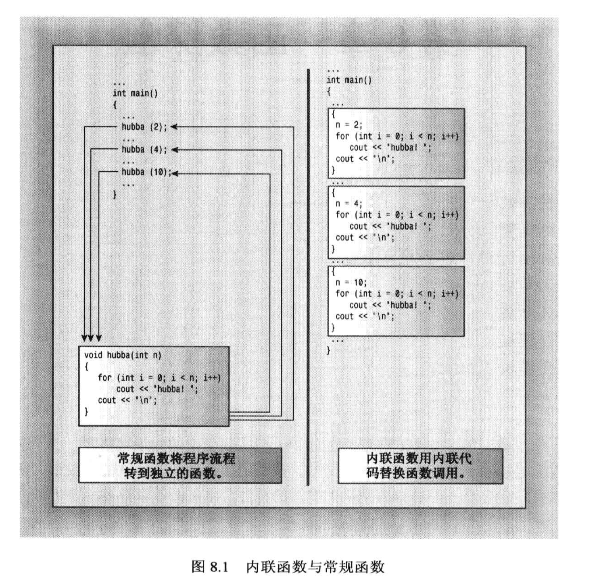
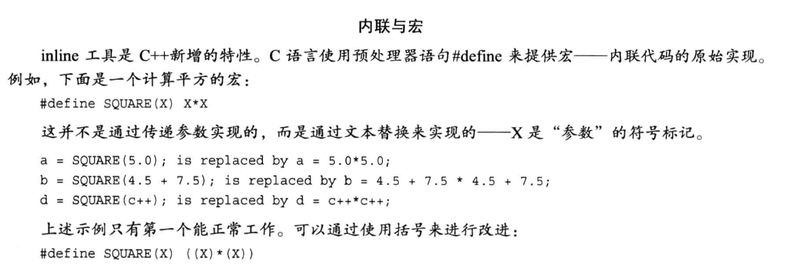
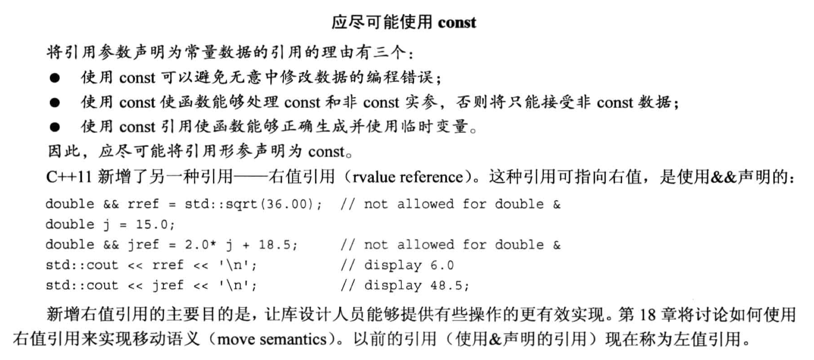
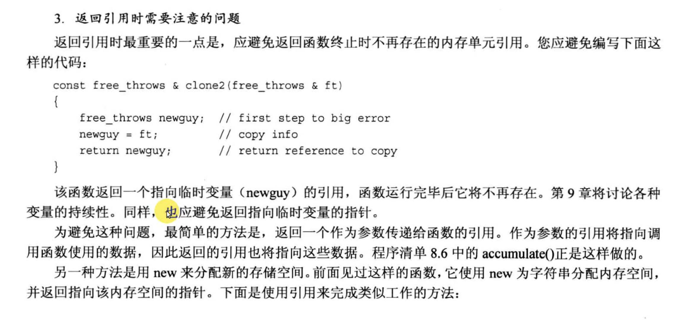
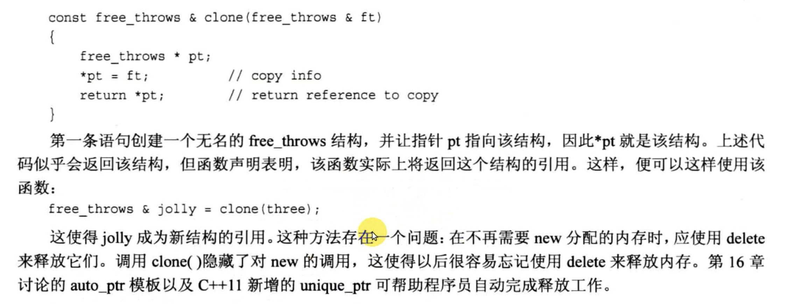
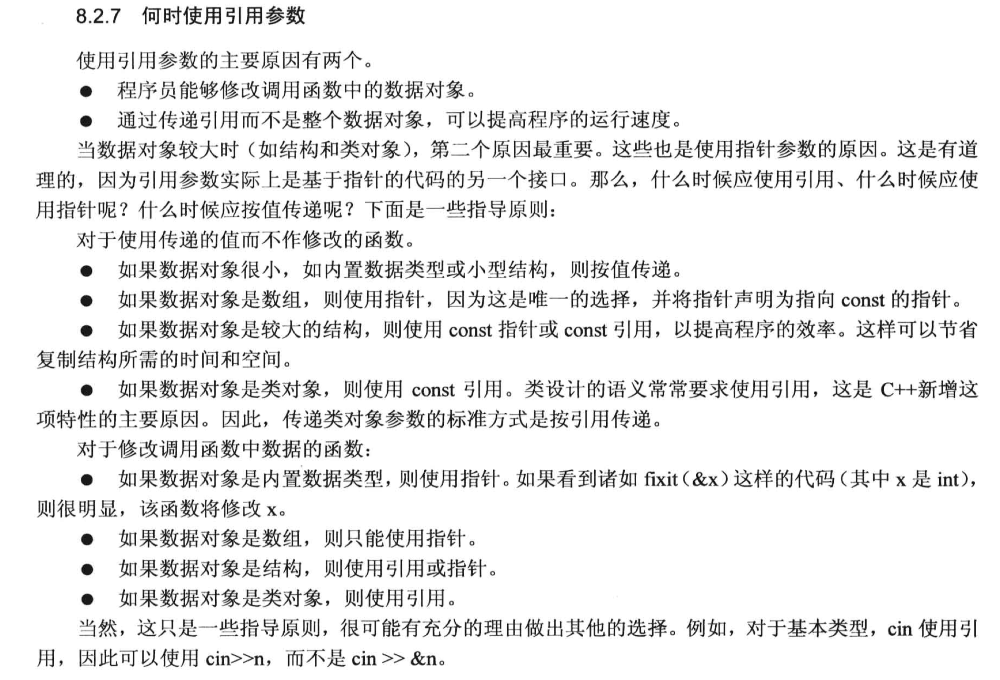

# 第八章 函数探幽 
这是C++ 特有的东西, C之后新增的内容.

## 8.1 C++ 内联函数
- 内联函数是 C++ 为提高程序运行速度所做的一项改进, 它与普通函数的区别主要在C++编译器如何将他们组合到程序中.
  - 普通函数在经过编译器编译之后, 执行方式通常是`通过跳转`到函数代码所在的内存空间, 等执行完函数之后, 再跳回到原来执行的主程序位置.
  - 内联函数则是在编译的时候, 将`函数调用处用函数体替换`, 也就是说, `内联函数的执行不需要跳转到函数体`, 而是直接执行函数体, 这样就提高了程序的运行速度. 
    - 内联函数的代价是占用更多内存.
    - 内敛函数与常规函数的调用流程图:
    

内联函数使用建议:
- 函数较短, 代码量不大时, 可以考虑使用内联函数
- 函数执行时间相比于函数调用时间较`短`时, 可以考虑使用内联函数. (主要思想是`以空间换时间`, 看看是不是收益比较大)

--- 
内敛函数的使用方法(二选一):
- 在`函数声明`前面加上关键字`inline`
- 在`函数定义`前面加上关键字`inline`

内敛函数的使用注意: 
1. 通常做法是`省略函数声明`, 直接把`函数整个定义`(函数头和函数体)都给写完, 然后在函数定义前面加上关键字`inline`.
2. 哪怕我们加上了 inline 关键字, `编译器也不一定会将其作为内联函数`, 比如编译器认为函数过长(过大), 或者这个函数调用了自己(一个递归函数, `递归函数不能作为内联函数`), 此时编译器就不会启用内联函数这种特性.

使用示例1: 
```cpp
#include <iostream>

using namespace std;

// 定义内联函数 (写法像一个宏, 但是比宏的功能更强)
inline double square(double x){return x*x;}

int main(void)
{
    double a,b;
    double c = 13.0;

    a = square(5.0);
    b = square(4.5+7.5);
    cout << "a = " << a << ", b = " << b << endl;
    cout << "c = " << c << endl;
    cout << "c square = " << square(c++) << endl;
    cout << "Now c = " << c << endl;

    return 0;
}
```

---

内联与宏:
- `函数宏`的写法: `#define SQUARE(X) X*X`
  - 有时候函数宏会出问题, 因为`函数宏不能按值传递`, `函数宏只进行文本替换, 很容易产生逻辑问题`!
  - 尽可能`使用内联函数, 而不是函数宏`.
  


## 8.2 引用变量
### 8.2.1 创建引用变量
- 变量的引用指的是原来变量的`别名`, 引用变量的声明方式为: 
  ```cpp 
  类型 &引用名 = 原来的变量名;
  int rat; 
  int &rodent = rat; // rodent 是 rat 的引用
  ```
- 如果在函数中使用变量的引用, 则真正使用的是`原来的变量`, 而不是变量的`副本`.

引用的代码例子:
```cpp
#include <iostream>
using namespace std;

int main(void)
{
    int rat = 10;
    int & rodent = rat;
    
    cout << "rat = " << rat << endl;
    cout << "rodent = " << rodent << endl;

    // 改变rodent
    rodent ++;
    cout << "rat = " << rat << endl;
    cout << "rodent = " << rodent << endl;

    // 观察地址
    cout << "rat's address: " << &rat << endl;
    cout << "rodent's address: " << &rodent << endl;

    return 0;
}
```
--- 
引用和指针的异同:
- 引用和指针**都可以直接操作原来的变量的值**, 而不是副本.
- `引用变量必须在初始化的时候就赋值`, 而指针可以先定义, 再赋值.
  ```cpp
  // 这里的写法是非法的!!
  int rat;
  int & rodent; // 不正确的写法, 会报错
  rodent = rat; // 不正确的写法, 会报错
  ```
- `引用变量一旦声明, 就不能改变`, 而**指针变量可以改变指向的变量**.
  - 也就是说, 引用`从始至终都效忠于同一个变量, 永不改变`.
  ```cpp
  #include <iostream>
  using namespace std;

  int main(void)
  {
      int rat = 101;
      int & rodent = rat;
      
      cout << "rat = " << rat << endl;
      cout << "rodent = " << rodent << endl;

      int bunnies = 50;
      rodent = bunnies;       // 关联成功了吗? no!
      cout << "bunnies = " << bunnies << endl;
      cout << "rodent = " << rodent << endl;      // 发现rodent的值变成了50

      cout << "rat = " << rat << endl;  
      /* 会发现 rat 也变成了50, 这说明上面的 
          rodent = bunnies 
          并不表示 rodent 成为了 bunnies 的别名, 这句代码仅仅是赋值语句
      */

      // 观察地址
      cout << "bunnies' address:\t" << &bunnies << endl;
      cout << "rat's address:\t\t" << &rat << endl;
      cout << "rodent's address:\t" << &rodent << endl;

      return 0;
  }
  ```

引用变量 与 指针: 
```cpp
// 指针可以随意改变指向的对象, 但是引用变量一旦声明, 就不能改变
int rats = 20;
int *pt = &rats; // pt 指向 rats
int &rodent = rat; // rodent 是 rats 的引用
int bunnies = 50;
pt = &bunnies; // pt 指向 bunnies
```


### 8.2.2 在函数中使用引用变量
代码例子1:
```cpp
#include <iostream>

using namespace std;

void swapr(int &a, int &b);
void swapp(int *a, int *b);
void swapv(int a, int b);

int main(void)
{
    int wallet1 = 300;
    int wallet2 = 350;

    cout << "wallet1 = " << wallet1 << endl;
    cout << "wallet2 = " << wallet2 << endl;

    cout << "Using reference to swap contents: " << endl;
    swapr(wallet1, wallet2);
    cout << "wallet1 = " << wallet1 << endl;
    cout << "wallet2 = " << wallet2 << endl;

    cout << "Using pointers to swap contents: " << endl;
    swapp(&wallet1, &wallet2);
    cout << "wallet1 = " << wallet1 << endl;
    cout << "wallet2 = " << wallet2 << endl;

    cout << "Trying to use passing by value:" << endl;
    swapv(wallet1, wallet2);        // 会发现没有发生交换
    cout << "wallet1 = " << wallet1 << endl;
    cout << "wallet2 = " << wallet2 << endl;

    return 0;
}

void swapr(int &a, int &b)
{
    int tmp = a;
    a = b;
    b = tmp;
}

void swapp(int * a, int *b)
{
    int tmp = *a;
    *a = *b;
    *b = tmp;
}

void swapv(int a, int b)
{
    int tmp = a;
    a = b;
    b = tmp;
}
```


代码例子2:
- 不适合使用引用的情况: 不希望值发生改变.
- 通常在传入结构体的并希望修改结构体的值时, 会使用引用.
```cpp
#include <iostream>

using namespace std;
double cube(double x);
double recube(double &ra);

int main(void)
{
    double x = 3.0;
    cout << "Cube of X: " << cube(x) << endl;

    cout << "Recube of X: " << recube(x) << endl;
    cout << "X = " << x << endl;

    return 0;
}

double cube(double x)
{
    x *= x * x;
    return x;
}

double recube(double &ra)
{
    ra *= ra * ra;
    return ra;
    // 换成  return ra * ra * ra; 此时 ra 就不会发生更改
}
```
- 注意: 
  - 在函数调用时, 如果使用`变量的引用`, 则**一定不能**在引用变量的位置上写`表达式`!!! 此时会编译报错! 解决办法就加const.
    ```cpp
    int a = 5;
    // 假设使用上面定义好的recube, 这种用法就会发生变异报错
    recube(5+x);
    ```
  - 如果引用变量的位置上加了`const`, 则此时可以使用表达式.
    ```cpp
    int a = 5;
    // 假设使用上面定义好的recube, 但是增加一个const
    recube(const int & a);
    rebube (5+a);  // 这种用法就不会报错
    ```
    - 不会报错的原因是:
      - 增加了`const`关键字之后, `C++内部会自动生成一个临时变量`, 用来存储表达式的值, 然后将这个`临时变量的引用`与函数那个引用变量关联起来, 此时, 如果函数内部对引用变量的值进行了更改操作, 此时被改掉的只是临时变量的值, 因此不会报错.


在函数中使用引用时, 应该尽可能使用`const`:



### 8.2.3 引用与结构体

代码例子 -- 函数返回结构体的引用:
```cpp
#include <iostream>
#include <string>
using namespace std;

struct free_throws
{
    string name;
    int made;
    int attemps;
    float percent;
};

void set_pc (free_throws & ft);
void display(const free_throws & ft);        // 显示的时候不应该修改任何东西, 加 const
// 注意: 这里的 accumulate 返回的是一个引用, 这样才能实现链式赋值
free_throws & accumulate(free_throws & target, free_throws & src);

int main(void)
{
    // percet 默认为0
    free_throws one = {"Rick", 13, 14};
    free_throws two = {"Jack", 10, 16};
    free_throws three = {"Jerry", 7,9 };
    free_throws four = {"Jason", 8, 11};
    free_throws five = {"Michael", 5, 14};
    free_throws team = {"Class 6", 0, 0};

    // 用函数填充percent, 再显示
    set_pc(one);
    display(one);

    // 累加并显示
    accumulate(team, one);
    display(team);

    display(accumulate(team, two));


    // 链式赋值
    accumulate(accumulate(accumulate(team, three), four), five);
    /*
    等价于:
        // accumulate(team, three);
        // accumulate(team, four);
        // accumulate(team, five);
    */
    display(team);

    return 0;
}

void set_pc (free_throws & ft)
{
    if (ft.attemps != 0){
        ft.percent = 100 * static_cast<float>(ft.made) / static_cast<float>(ft.attemps);
    }
    else{
        ft.percent = 0;
    }
}

void display(const free_throws & ft)        // 显示的时候不应该修改任何东西, 加 const
{
    cout << "Name: " << ft.name << endl;
    cout << "Made: " << ft.made << "\t";
    cout << "Attemps: " << ft.attemps << "\t";
    cout << "Percent: " << ft.percent << endl;
}

free_throws & accumulate(free_throws & target, free_throws & src)
{
    target.attemps += src.attemps;
    target.made += src.made;
    set_pc(target);
    return target;
}
```
- 如果 return 一个结构体, 此时编译的操作是:
  - 情况1: return 出去的结构体`不是引用`:
    - 编译器会先临时开辟一个内存空间, 用来存放这个结构体
    - 然后在函数调用的位置把这个临时的结构体空间返回出去 (如果有变量等待接收, 就把这个内存赋值给它)
  - 情况2: return 出去的`结构体是一个引用变量`:
    - 直接`执行结构体的对拷`操作, 效率更高. 比如:
    ```cpp
    // accumulate函数按照上面的例子的定义
    free_throws dup = accumulate(team, one);
    /* 
      由于 accumulate 返回的结构体是 team 的引用, 所以编译器在函数调用结束时, 
        是直接执行 dup 和 team 的对拷操作, 没有开辟临时内存空间!!!
    */
    ```

- 返回引用需要注意, 引用变量一定要确保没有被释放!!

- 如果使用`指针`来实现返回引用, 则一定要注意指针是否被释放, `是否容易出现内存泄露`问题!



### 8.2.5 引用 与 类对象

代码例子:
```cpp
#include <iostream>
#include <string>

using namespace std;
string version1(const string & s1, const string &s2);
const string & version2(string &s1, const string &s2);
const string & version3(string &s1, const string &s2);

int main(void)
{
    string Input;
    string Result;
    string copyStr;

    cout << "Enter a string: ";
    getline(cin, Input);
    copyStr = Input;
    cout << "Your string as entered: " << Input << endl;
    cout << "--------------------" << endl;

    Result = version1(Input, "***");      // 在字符串的前缀和后缀加*
    cout << "Your string enhanced: " << Result << endl;
    cout << "Your original string: " << Input <<  endl;
    cout << "--------------------" << endl;

    Result = version2(Input, "###");        // 注意version2返回的是 "引用" 哦!
    cout << "Your string enhanced: " << Result << endl;
    cout << "Input now becomes: " << Input <<  endl;
    
    cout << "--------------------" << endl;
    Input = copyStr;        // 恢复到初始值
    // 此时 version3 返回的值已经被释放掉了, 在linux中, 程序运行到这里会崩掉
    Result = version3(Input, "@@@");
    cout << "Your string enhanced: " << Result << endl;
    cout << "Input now becomes: " << Input <<  endl;

    return 0;
}

// 1. string类中定义了 char* 到 string类型的转换, 使得我们可以用 char* 直接初始化string对象
// 2. 在函数中, 如果在引用变量前加 const, 那么当引用类型 与 传入的实参类型不匹配时(但可以被正确转换), 
//   编译器会自动创建一个临时变量进行适配
// 3. version1 返回的是"值", 走的是"按值传递"的方式, 变量的值在return时存放到临时内存空间中.
string version1(const string & s1, const string &s2)
{
    return s2 + s1 + s2;
}

// version2 返回的是引用!!!
const string & version2(string &s1, const string &s2)
{
    s1 = s2 + s1 + s2;
    return s1;
}


const string & version3(string &s1, const string &s2)
{
    string tmp;
    tmp = s2 + s1 + s2;
    return tmp;     // 返回引用的时候 tmp 会在函数调用结束时被释放!
}
```
- 注意看上面例子中的注释部分.


### 8.2.6 对象, 继承和引用
- 继承中最常用的特性: 
  - 派生类**继承**了基类的方法, 因此`派生类可以直接使用基类的方法`. 
    - 如 ofstream 是由 ostream 派生出来的, 所以 ofstream 可以使用 ostream 的方法, 如格式化方法 `precision()` 和 `setf()`.
  - 基类**引用**可以`指向派生类的对象`.  

代码例子:
```cpp
/*
    当物镜焦距一定时, 计算不同目镜焦距下的放大倍数.
*/
#include <iostream>
#include <fstream>

using namespace std;
const int LIMIT = 5;
void file_it(ostream &OS, double fo, const double fe[], int n);

int main(void)
{
    fstream fout;
    const char *fn = "ep-data.txt";

    fout.open(fn);
    if(!fout.is_open()){        // 打开失败
        cout << "Can't open " << fn << ".Bye" << endl;
        exit(EXIT_FAILURE);     // 直接结束程序
    }

    double objective;       // 物镜的焦距
    cout << "Enter the focal length of telescope objective in mm:" << endl;
    cin >> objective;

    double eps[LIMIT];      // 目镜的焦距(数组)
    for (int i = 0; i < LIMIT; i++){
        cout << "EyePieces #" << i+1 << endl;
        cin >> eps[i];
    }

    file_it(cout, objective, eps, LIMIT);      // 在终端中显示结果
    file_it(fout, objective, eps, LIMIT);      // 在文件中记录结果

    cout << "Done!" << endl;
    return 0;
}

/* 
形参的定义中使用到知识点: 
    1. 基类对象的引用既可以"指向基类对象", 也可以指向"派生类对象"
    2. 数组可以使用数组表示法, 也可以使用指针表示法(本质上两种都是在传递指针)
*/
void file_it(ostream &OS, double fo, const double fe[], int n)
{
    // OS 是基类对象的引用, 通过传入对象的不同可以实现不同的执行效果
    OS << "Focal Length of objective: " << fo << endl;
    OS << "f.1. eyepieces " << "magnification" << endl;
    for (int i = 0; i < LIMIT; i++){
        OS << "\t" << fe[i] << "\t" << static_cast<int>(fo/fe[i] + 0.5) << endl;
    }
}
```
- ostream 是基类, ofstream 是派生类
  - 引用参数 OS 是 ostream 类型的引用, 因此可以传入 ofstream 类型的对象, 因为 ofstream 是 ostream 的派生类.
    - 通过引用对象绑定对象的不同(派生类与基类), 实现了完全不一样的效果.

---
### 8.2.7 何时使用引用参数


- 小结:
  - `数组`: 一定且只能使用`指针`!
  - 类的对象: 用`引用`
  - 传递结构体: 指针或引用都可以. 
  - **基本类型**且**想修改**数值: 用指针
  - **不修改原始数据**或**数据量不大**: 按值传递 

