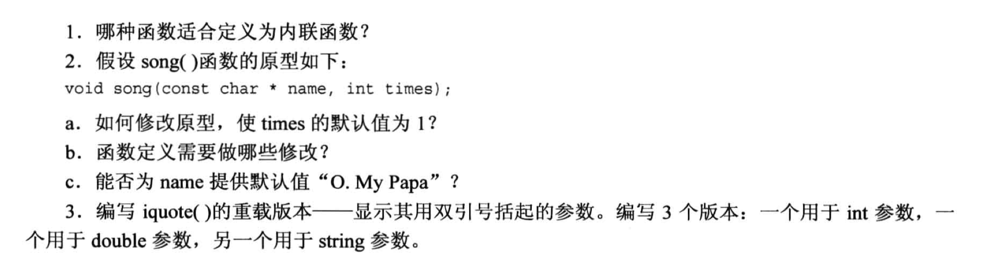
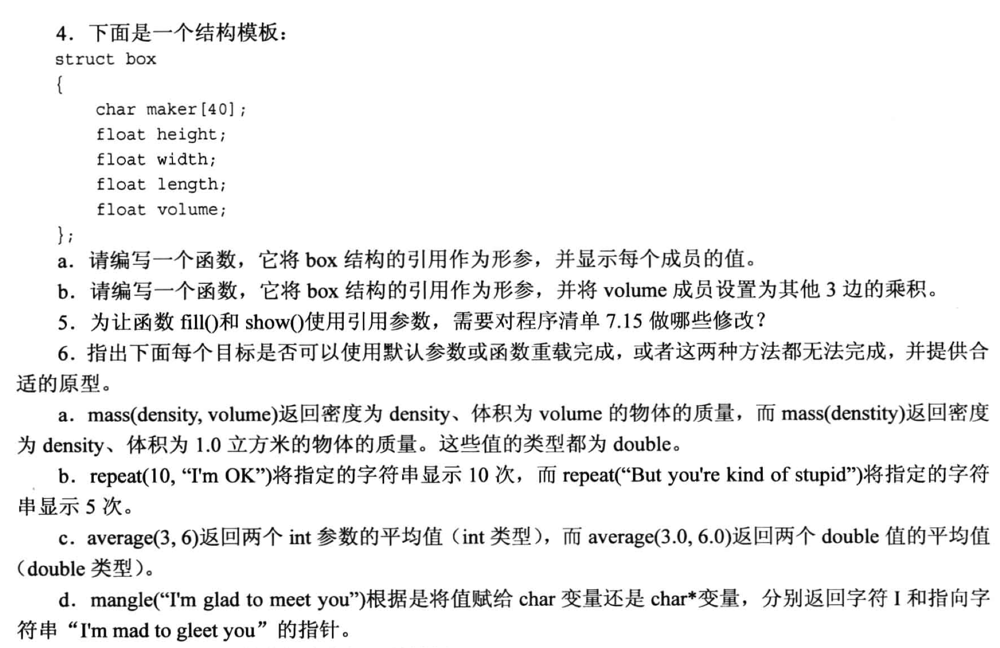
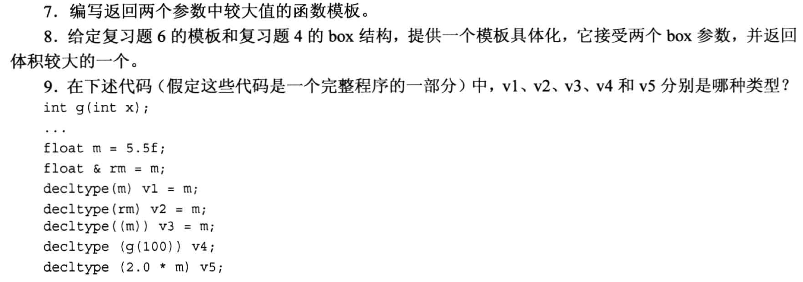

# 复习题




## 1. 
内联函数是直接把函数代码插入到调用的位置, 节省了调用函数时进行跳转的时间, 但同事会增加代码的占用空间.
使用内敛函数的准则是:
1. 函数代码简单, 不长
2. 函数`不是递归函数`

## 2.
```cpp
// a.
void song(const char * name, int times = 1);    // 注意是函数 原型 中增加

// b.
// ans: 只在在函数原型(声明)中添加默认参数, 在函数定义中 不写 任何默认参数

// c. 
// ans: 能, 但是此时 times 也需要对应设置默认值. 或者把 name 放在右侧 
```

## 3.
```cpp
#include <iostream>
using namespace std;

// v1:
void iquote(int n)
{
    cout << "\"" << n << "\"" << endl;      // 需要转义字符
}

// v2:
void iquote(double d)
{
    cout << "\"" << d << "\"" << endl;      // 需要转义字符
}

// v3:
void iquote(string s)
{
    cout << "\"" << s << "\"" << endl;      // 需要转义字符
}
```

## 4.
```cpp
struct box
{
    char maker[40];
    float height;
    float width;
    float length;
    float volume;
};

// a: 
void ShowBox(const box & a)
{
    cout << "maker: " << a.maker << endl;
    cout << "height: " << a.height << endl;
    cout << "width: " << a.width << endl;
    cout << "length: " << a.length << endl;
    cout << "volume: " << a.volume << endl;
}

// b:
void SetVolume(box & a)
{
    a.volume = a.height * a.width * a.length;
}
```

## 5.
- 修改函数声明
- 修改函数体(函数定义)

修改后的代码:
```cpp
#include <iostream>
#include <array>
#include <string>

using namespace std;
const int SEASONS = 4;

void fill(array<double, SEASONS> &pa);
void show(const array<double, SEASONS> &da);

const array<string, SEASONS> Snames = {"Spring", "Summer", "Fall", "Winter"};  // 初始化四个季节的名字

int main(void)
{
    array<double, SEASONS> expenses;  // expenses 用来存放四个季节的开销
    fill(expenses);                  // 防止拷贝, 传指针
    show(expenses);

    return 0;
}

void fill(array<double, SEASONS> &pa)           // 要修改数组, 所以不加 const 做保护
{
    for(int i = 0; i < SEASONS; i++){
        cout << "Enter " << Snames[i] << " expenses: ";
        cin >> pa[i];                        // (*pa) 先将指针转换为 array 对象, 只有 array 对象可以像数组一样操作, 但是array指针是不可以直接像指针一样的操作的, 因为array指针"并不表示第数组的第一个元素的地址"!
    }
}

void show(const array<double, SEASONS> &da)
{
    double total = 0.0;
    cout << "EXPENSES: " << endl;
    for (int i = 0; i < SEASONS; i++){
        cout << Snames[i] << "\t: $" << da[i] << endl;
        total += da[i];
    }
    cout << "Total: " << total << endl;
}
```

## 6.

```cpp
// a. 可以直接使用默认值的方式来完成
double mass(double density, double volume = 1.0);

// b. 由于指定显示次数位于左边, 而字符串位于右边, 此时无法使用默认参数, 需要用函数重载
void repeat(const char * str, int times = 5);
void repeat(const char *); // time在函数里写死就行了

// c. 传入参数的类型不同, 需要使用重载的函数来完成
int average(int a, int b);
double average(double a, double b);

// d. 注意此时传入一个字符数组和传递一个字符串都是一样的, 它们实际传入的就是一个指针, 也就是说下面这两个函数的特征标是相同的, 因此 **无法使用重载** 来完成, 也 **无法使用默认值** 来完成
char mangle(const char str[]);      // 特征标与下面的函数相同
char * mangle(const char * str);  
```

## 7. 
```cpp
template <typename T>
T Max(T a, T b)
{
    return a > b ? a : b;
}
```

## 8.
```cpp
struct box
{
    char maker[40];
    float height;
    float width;
    float length;
    float volume;
};

template <typename T>
T Max(T a, T b)
{
    return a > b ? a : b;
}

template <> box Max(box b1, box b2)           // 注意返回的类型还是 box 
{
    return b1.volume > b2.volume ? b1 : b2;   // 返回的是 box 类型的 b1 或 b2
}
```

## 9.
```cpp
int g(int x);
...
float m = 5.5f;
float & rm = m;
decltype(m) v1 = m;     // float
decltype(rm) v2 = m;    // float &
decltype((m)) v3 = m;   // float &
decltype(g(100)) v4;    // int
decltype(2.0 * m) v5;   // double   (m 自动从 float 提升为 double)
```


