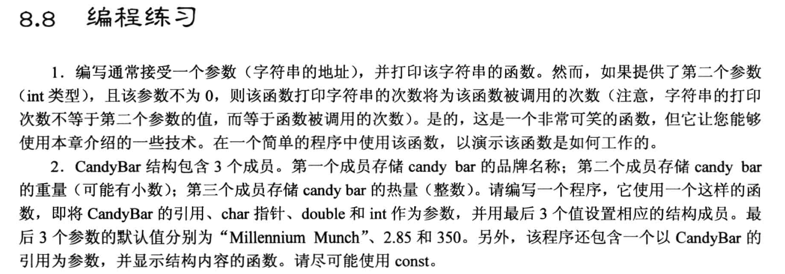
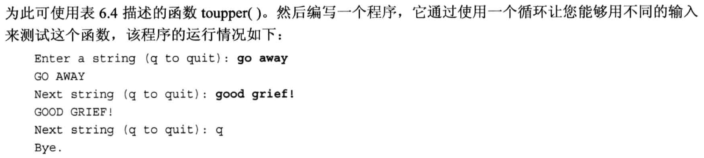
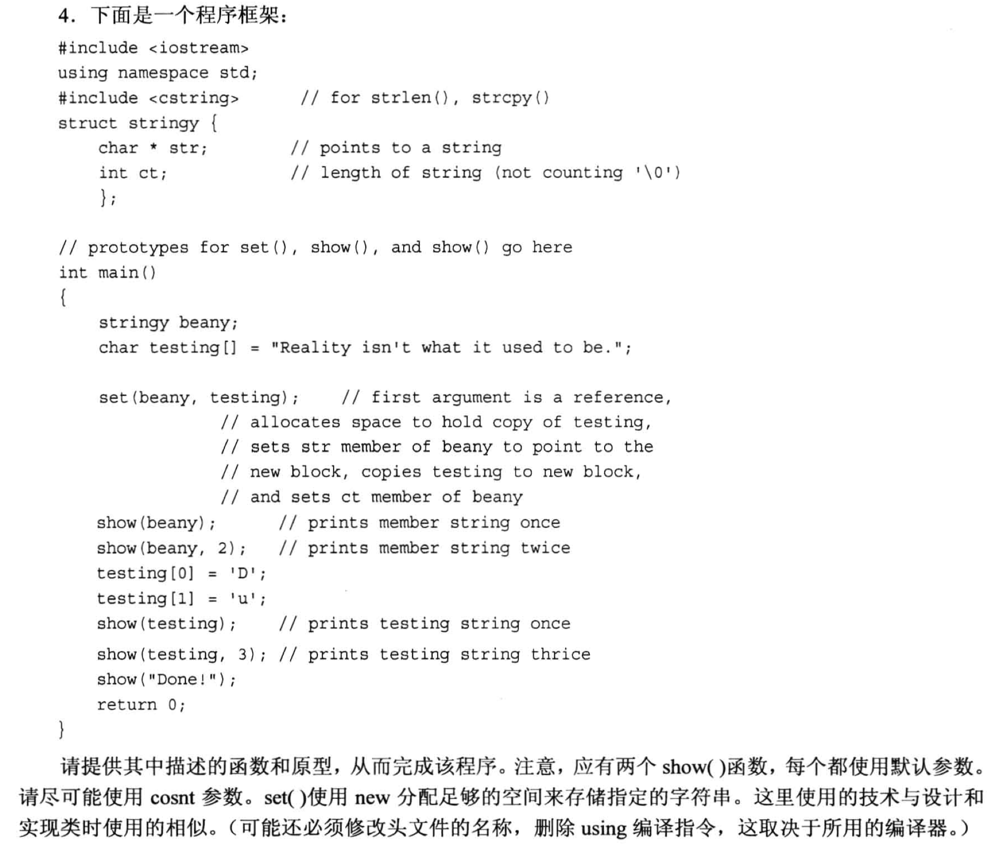
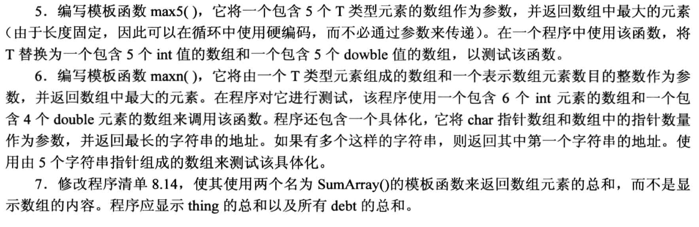

# 编程练习题






## 1.
```cpp
#include <iostream>
using namespace std;

void show(const char * str, int n = 0);

int main(void)
{
    show("Hello World!");
    show("Good Morning!");
    show("I love you, Rick.",8);

    return 0;
}

void show(const char * str, int n)
{
    // 定义一个静态变量, 它的可以使得在函数中定义的局部变量相当于一个"全局变量", 它只会被初始化1次.
    static int num = 0;     // 这个语句只会被调用1次
    num++;                  // 每次调用函数都会执行一次

    if (0 == n){
        cout << str << endl;
    }
    else{
        for(int i = 0; i < num; i++){
            cout << str << endl;
        }
    }
}
```

## 2.
```cpp
#include <iostream>
#include <cstring>

using namespace std;
const int SIZE = 30;
struct CandyBar
{
    char brand[SIZE];
    double weight;
    int heat;
};

void setValue(CandyBar & candybar, const char * str = "Millennium Munch", const double w = 2.85, const int h = 350);

void show(const CandyBar & bar);

int main(void)
{
    CandyBar bar;
    setValue(bar);
    show(bar);
    return 0;
}

void setValue(CandyBar & candybar, const char * str, const double w, const int h)
{
    strcpy(candybar.brand, str);
    candybar.weight = w;
    candybar.heat = h;
}

void show(const CandyBar & bar)
{
    cout << "Brand: " << bar.brand << endl;
    cout << "Weight: " << bar.weight << endl;
    cout << "Heat: " << bar.heat << endl;
}
```

## 3.
```cpp
#include <iostream>
#include <string>
#include <cctype>       // 为了使用 toupper 函数

using namespace std;

void to_upper(string &str);

int main(void)
{
    cout << "Enter a string (q to quit): ";
    string str;

    getline(cin, str);
    while( str != "q"){
        to_upper(str);
        cout << str << endl;
        cout << "Enter a string (q to quit): ";
        getline(cin, str);
    }
    cout << "Bye!" << endl;

    return 0;
}

void to_upper(string &str)
{
    for (int i = 0; i < str.size(); i ++){
        str[i] = toupper(str[i]);
    }
}
```

## 4.


