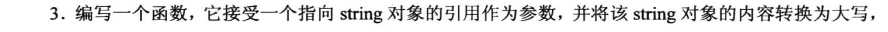

# 编程练习题




## 1.
```cpp
#include <iostream>
using namespace std;

void show(const char * str, int n = 0);

int main(void)
{
    show("Hello World!");
    show("Good Morning!");
    show("I love you, Rick.",8);

    return 0;
}

void show(const char * str, int n)
{
    // 定义一个静态变量, 它的可以使得在函数中定义的局部变量相当于一个"全局变量", 它只会被初始化1次.
    static int num = 0;     // 这个语句只会被调用1次
    num++;                  // 每次调用函数都会执行一次

    if (0 == n){
        cout << str << endl;
    }
    else{
        for(int i = 0; i < num; i++){
            cout << str << endl;
        }
    }
}
```

## 2.
```cpp
#include <iostream>
#include <cstring>

using namespace std;
const int SIZE = 30;
struct CandyBar
{
    char brand[SIZE];
    double weight;
    int heat;
};

void setValue(CandyBar & candybar, const char * str = "Millennium Munch", const double w = 2.85, const int h = 350);

void show(const CandyBar & bar);

int main(void)
{
    CandyBar bar;
    setValue(bar);
    show(bar);
    return 0;
}

void setValue(CandyBar & candybar, const char * str, const double w, const int h)
{
    strcpy(candybar.brand, str);
    candybar.weight = w;
    candybar.heat = h;
}

void show(const CandyBar & bar)
{
    cout << "Brand: " << bar.brand << endl;
    cout << "Weight: " << bar.weight << endl;
    cout << "Heat: " << bar.heat << endl;
}
```

## 3.
```cpp
#include <iostream>
#include <string>
#include <cctype>       // 为了使用 toupper 函数

using namespace std;

void to_upper(string &str);

int main(void)
{
    cout << "Enter a string (q to quit): ";
    string str;

    getline(cin, str);
    while( str != "q"){
        to_upper(str);
        cout << str << endl;
        cout << "Enter a string (q to quit): ";
        getline(cin, str);
    }
    cout << "Bye!" << endl;

    return 0;
}

void to_upper(string &str)
{
    for (int i = 0; i < str.size(); i ++){
        str[i] = toupper(str[i]);
    }
}
```

## 4.
```cpp
#include <iostream>
#include <cstring>

using namespace std;
struct stringy
{
    char *str;
    int ct;
};

void set(stringy &str, const char *source);
void show(const stringy & beany, int n = 1);
void show(const char *str, int n = 1);

int main(void)
{
    stringy beany;
    char testing[] = "Reality isn't what it used to be.";

    set(beany, testing);
    show(beany);
    show(beany, 2);
    cout << "----" << endl;
    testing[0] = 'D';
    testing[1] = 'u';
    show(testing);
    show(testing, 3);
    show("Done!");

    delete beany.str;
    return 0;
}

void set(stringy &str, const char *source)
{
    str.ct = strlen(source) + 1;        // 记录字符串的大小
    str.str = new char[str.ct];         // 注意应该使用方括号!!
    strcpy(str.str, source);
}

void show(const stringy & beany, int n)
{
    for (int i = 0; i < n; i++){
        cout << beany.str << endl;
    }
}

void show(const char *str, int n)
{
    for (int i = 0; i < n; i++){
        cout << str << endl;
    }
}
```

## 5. 
```cpp
#include <iostream>

using namespace std;

template <typename T>
T max5(T t[]);

int main(void)
{
    int arr_i[5] = {1,3,5,7,9};
    double arr_d[5] = {1.3, 22.2, 13.8, 17.9, 14.2};

    cout << "The max value of arr_i: " << max5(arr_i) << endl;
    cout << "The max value of arr_d: " << max5(arr_d) << endl;

    return 0;
}

template <typename T>
T max5(T t[])
{
    T max = t[0];
    for (int i = 1; i < 5; i++){
        if (max < t[i]){
            max = t[i];
        }
    }
    return max;
}
```

## 6. 
```cpp
#include <iostream>
#include <string>

using namespace std;

template <typename T>
T maxn(T t[], int n);

template <> 
string maxn <string> (string str[], int n);

int main(void)
{
    int arr_i[6] = {1,3,5,7,9,11};
    double arr_d[4] = {1.3, 22.2, 13.8, 17.9};

    string str[5] = {"hello world", "good morning", "I love you Rick", "What is this?", "Bye"};

    cout << "The max value of arr_i: " << maxn(arr_i, 6) << endl;
    cout << "The max value of arr_d: " << maxn(arr_d, 4) << endl;
    cout << "The max value of str: " << maxn(str, 5) << endl;

    return 0;
}

template <typename T>
T maxn(T t[], int n)
{
    T max = t[0];
    for (int i = 1; i < n; i++){
        if (max < t[i]){
            max = t[i];
        }
    }
    return max;
}

// 针对 char * 做具体化
template <> 
string maxn <string>(string str[], int n)       // 注意 str 是数组, 别漏了 []
{
    int pos = 0;
    for (int i = 0; i < n; i++){
        if (str[pos].size() < str[i].size()){
            pos = i;
        }
    }
    return str[pos];
}
```

## 7.
```cpp
#include <iostream>

using namespace std;

template <typename T>
void ShowArray(T arr[], int n);      // #1

template <typename T>
void ShowArray(T * arr[], int n);    // #2

template <typename T>
T SumArray(T arr[], int n);

template <class T>
T SumArray(T *arr[], int n);

struct debts
{
    char name[50];
    double amount;
};

int main(void)
{
    int things[6] = {13, 31, 03, 301, 310, 130};

    ShowArray(things, 6);

    struct debts mr_E[3] =      // 这个 struct 加不加都可以
    {
        {"Rick", 2400.00},
        {"Jack", 1300.00},
        {"Rose", 1800.00}
    };

    double *pd[3];   // 指针数组, 数组有3个元素, 每个元素都是double类型的指针

    for(int i = 0; i < 3; i++){
        pd[i] = &mr_E[i].amount;        // 传递数据的指针
    }
    
    ShowArray(pd, 3);       // 此时若匹配到 #1, 打印出来的是地址; 如果匹配到 #2, 则正常输出.
                            // 从实验结果来看, 会匹配到#2, 而且 #2 确实是"最省事"的

    cout << "The sum of things: " << SumArray(things, 6) << endl;
    cout << "The sum of pd: " << SumArray(pd, 3) << endl;

    return 0;
}

template <typename T>
void ShowArray(T arr[], int n)      // #1 
{
    cout << "Template A: " << endl;
    for (int i = 0; i < n; i++){
        cout << arr[i] << " " ;
    }
    cout << endl;
}

template <typename T>
void ShowArray(T * arr[], int n)    // #2
{
    cout << "Template B: " << endl;
    for (int i = 0; i < n; i++){
        cout << *arr[i] << " " ;
    }
    cout << endl;
}

template <typename T>
T SumArray(T arr[], int n)
{
    T Sum = 0;
    for(int i = 0; i < n; i++){
        Sum += arr[i];
    }
    return Sum;
}

template <class T>
T SumArray(T *arr[], int n)
{
    T Sum = 0;
    for (int i = 0; i < n; i++){
        Sum += *arr[i];
    }
    return Sum;
}
```