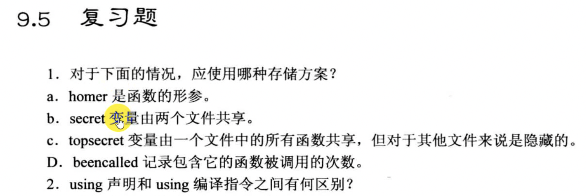
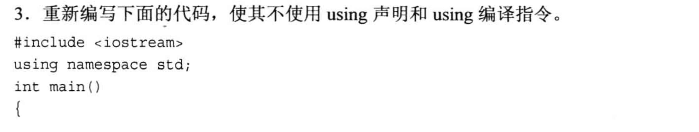
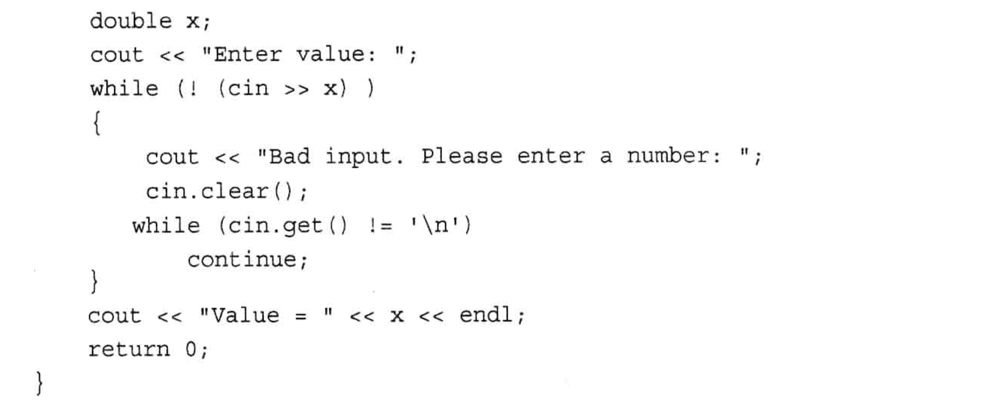
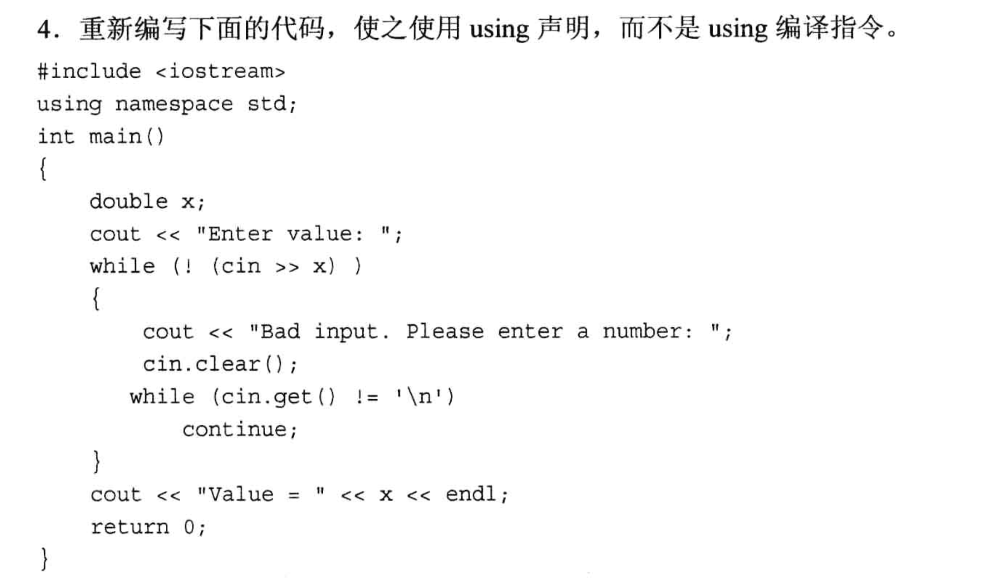
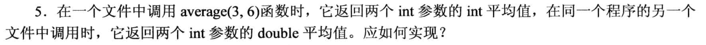
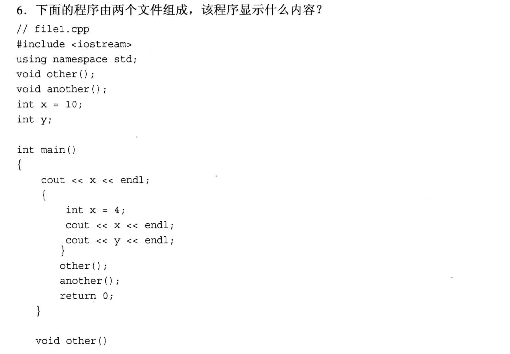
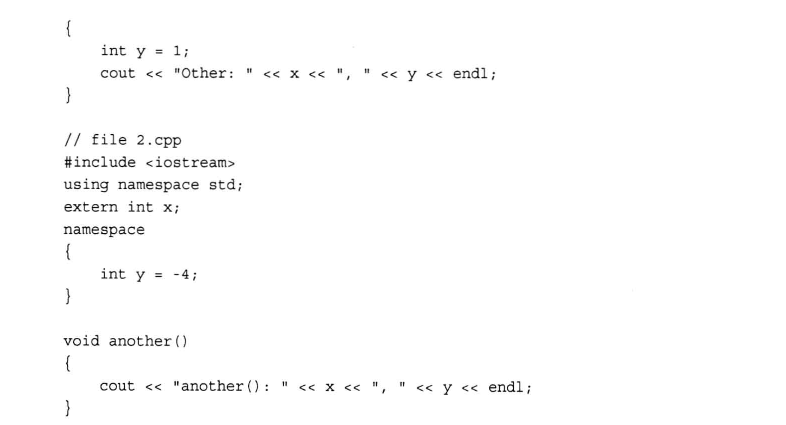
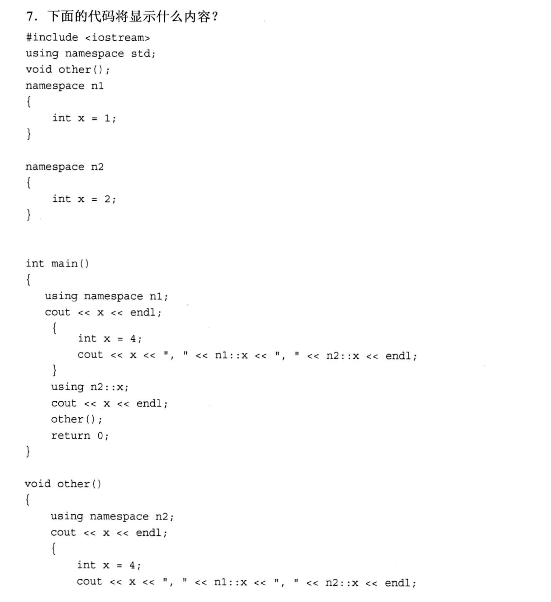
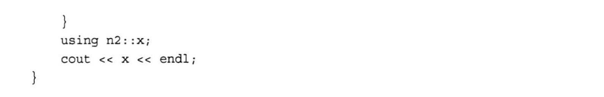

# 复习题











## 1
1. homer 的声明周期只在函数的参数列表, 因此应定义为`自动变量`, 也就是在函数运行结束后自动释放掉
2. 在第一个文件中定义为`全局变量`, 第二个文件在声明的时候加上关键词`extern`即可.
3. 只需要在 topsecret 前面加上关键词`static`, 并且将topsecrect定义为`全局变量`就可以了, `static修饰的全局变量只能在当前文件中访问`
   1. 还以可以使用`未命名的名称空间`, 在这种命名空间内部定义这个 topsecret 就可以了
4. 把 beencalled `定义在函数的内部`, 并且在前面加上`static关键词`, 此时这个beencalled只会被初始化一次, 并且之后调用函数的时候, benncalled 在前一次调用函数的时候对应的值能直接继续使用.


## 2
* using声明: using 后面声明的东西在之后的代码语句中是可直接使用的, 但是除了被声明的东西之外, 命名空间中的其他组成部分还是不可见的.
  * using声明语句会`相当于"自动变量/局部变量"`, 此时如果在想定义一个同名的局部变量将报错(重定义错误), 但是using编译语句则不会有这个问题.
* using编译: 在这个语句之后, 命名空间里的所有组成部分都可以直接使用.
  * 如果在using编译语句之后, 又额外定义了一个与命名空间里同名的变量, 则此时根据`就近原则`, 额外的定义的同名变量会隐藏掉命名空间里的变量.


## 3
1. 去掉 `using namespace std`
2. 在所有的 cin, cout, endl 前增加 `std::`, 变成`std::cin`, `std::cout`, `std::endl`


## 4
在main函数开头加上`using std::cin; using std::cout; using std::endl`.

## 5
两个文件`分别定义各自的 average`函数, 但是前面都需要增加关键词`static`, 此时就不会产生重定义问题. 
- 需要注意这里的参数列表是相同的, 不能使用函数重载!

## 6
```txt
// 调用main
10
4
0
Other: 10, 1       // main里的代码块的 other 函数
another: 10, -4    // main里的 another 函数
```


## 7
```txt
1
4, 1, 2
2
2, 4, 1, 2           // other函数
2                    // other函数
```

