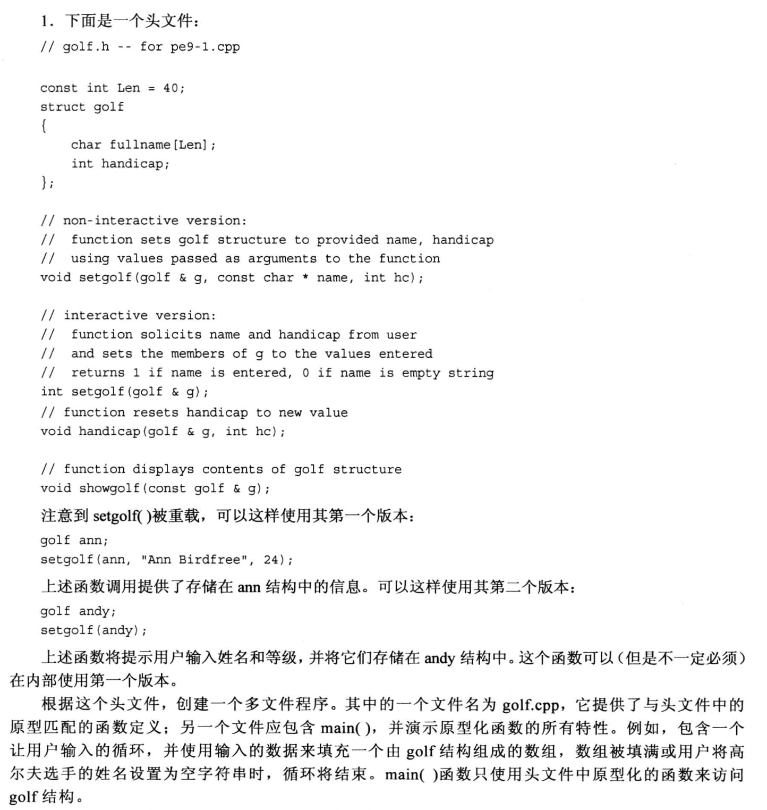
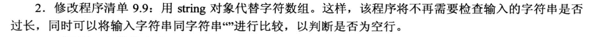
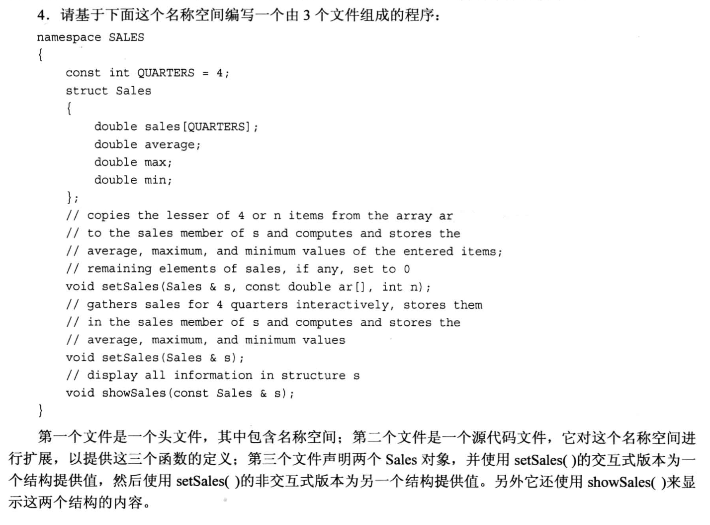

# 编程题







## 1.
头文件`golf.h`:
```cpp
const int Len = 40;
struct golf
{
    char fullname[Len];
    int handicap;
};

void setgolf(golf & g, const char * name, int hc);

int setgolf(golf & g);

void handicap(golf & g, int hc);

void showgolf(const golf &g);
```
cpp文件`golf.cpp`:
```cpp
#include <iostream>
#include <cstring>
#include "golf.h"

using namespace std;

void setgolf(golf &g, const char *name, int hc)
{
    strcpy(g.fullname, name);   // 字符串拷贝
    g.handicap = hc;
}

int setgolf(golf &g)
{
    int temp = 1;       // true
    cout << "The fullname is: ";
    cin.getline(g.fullname, Len);       // 捕获一整行

    // 比较字符串, 看看输入是否成功
    if(strcmp(g.fullname, "") == 0){
        cout << "invalid input! Ending this gold player info..." << endl;
        temp = 0;       // false
        return temp;
    }
    else{
        cout << "The handicap is: ";
        cin >> g.handicap;
        cin.get();              // 清除缓冲区里的回车
        return temp;
    }
}

void handicap(golf &g, int hc)
{
    g.handicap = hc;
}

void showgolf(const golf &g)
{
    cout << "The fullname is: " << g.fullname << endl;
    cout << "The Handicap is: " << g.handicap << endl;
}

```

main文件`main.cpp`:
```cpp
#include <iostream>
#include "golf.h"

using namespace std;

const int SIZE = 3;

int main(void)
{
    golf g[SIZE];      // 2个数组
    int count = 0;     // 统计输入的次数

    cout << "Please enter the infomation of golf players: " << endl;

    while( count < SIZE && setgolf(g[count]) ){
        cout << "Please enter next player: " << endl;
        count ++;
    }

    cout << "\nShowing all golg infomations..." << endl;

    for(int i = 0; i < count; i++){
        showgolf(g[i]);
    }

    cout << "Reset all the player's information..." << endl;

    for (int i  = 0; i < count; i++){
        handicap(g[i], 90);
        showgolf(g[i]);
    }
    return 0;
}

```

