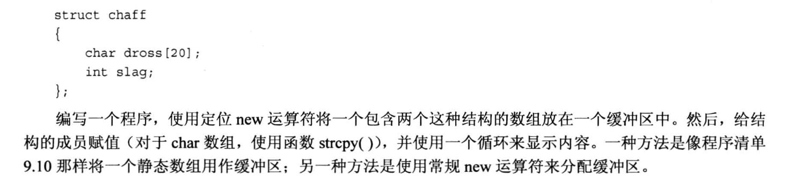

# 编程题





## 1.
头文件`golf.h`:
```cpp
const int Len = 40;
struct golf
{
    char fullname[Len];
    int handicap;
};

void setgolf(golf & g, const char * name, int hc);

int setgolf(golf & g);

void handicap(golf & g, int hc);

void showgolf(const golf &g);
```
cpp文件`golf.cpp`:
```cpp
#include <iostream>
#include <cstring>
#include "golf.h"

using namespace std;

void setgolf(golf &g, const char *name, int hc)
{
    strcpy(g.fullname, name);   // 字符串拷贝
    g.handicap = hc;
}

int setgolf(golf &g)
{
    int temp = 1;       // true
    cout << "The fullname is: ";
    cin.getline(g.fullname, Len);       // 捕获一整行

    // 比较字符串, 看看输入是否成功
    if(strcmp(g.fullname, "") == 0){
        cout << "invalid input! Ending this gold player info..." << endl;
        temp = 0;       // false
        return temp;
    }
    else{
        cout << "The handicap is: ";
        cin >> g.handicap;
        cin.get();              // 清除缓冲区里的回车
        return temp;
    }
}

void handicap(golf &g, int hc)
{
    g.handicap = hc;
}

void showgolf(const golf &g)
{
    cout << "The fullname is: " << g.fullname << endl;
    cout << "The Handicap is: " << g.handicap << endl;
}

```

main文件`main.cpp`:
```cpp
#include <iostream>
#include "golf.h"

using namespace std;

const int SIZE = 3;

int main(void)
{
    golf g[SIZE];      // 2个数组
    int count = 0;     // 统计输入的次数

    cout << "Please enter the infomation of golf players: " << endl;

    while( count < SIZE && setgolf(g[count]) ){
        cout << "Please enter next player: " << endl;
        count ++;
    }

    cout << "\nShowing all golg infomations..." << endl;

    for(int i = 0; i < count; i++){
        showgolf(g[i]);
    }

    cout << "Reset all the player's information..." << endl;

    for (int i  = 0; i < count; i++){
        handicap(g[i], 90);
        showgolf(g[i]);
    }
    return 0;
}
```

## 2.
```cpp
/*
    局部静态变量 -- 代码块中使用static
*/

#include <iostream>
#include <string>
using namespace std;

void strCount(const string str);

int main(void)
{
    string input;
    char next;

    cout << "Enter a line (less than 9 chars):" << endl;

    getline(cin,input);
    while(input != ""){                 // 判断是否真的有输入
        // 捕获单个字符, 用来检测是不是因为输入回车才结束输入 (cin.get()遇到回车时, 不仅会结束输入, 还会把回车存放在缓冲区)
        cin.get(next);
        strCount(input);        // 统计一共捕获了多少个字符
        cout << "Enter next line (empty line to quit)" << endl;
        getline(cin, input);
    }
    cout << "Bye!" << endl;     // 此时输入的是空行.

    return 0;
}

void strCount(const string str)
{
    static int total = 0;       // 局部静态变量(只会初始化一次, 多次调用strCount也不会反复初始化)
    int count = 0;              // 局部变量(每次都会初始化)

    count = str.size();
    total += count;             // 统计整个程序一共输入了多少个字符

    cout << count << " characters" << endl;
    cout << total << " characters in total." << endl;
    cout << "----------- \n"; 
}
```

## 3.
```cpp
#include <iostream>
#include <cstring>      // 使用strcpy函数
#include <new>

using namespace std;

struct chaff
{
    char dross[20];
    int slag;
};

void show(const chaff &p);

const int BUF = 512;
char buffer[BUF];       // 为了使用placement new

int main(void)
{
    // method 1: 定位new
    chaff *pd1 = new(buffer) chaff[2];      // 一个结构体类型指针, 指向一个结构体数组, 数组有两个元素

    // method 2: 常规new
    chaff *pd2 = new chaff[2];

    char dross[20] = "";
    int slag = 0;

    // 赋值
    for(int i = 0; i < 2; i++){
        cout << "#" << i+1 << ": " << endl;
        cout << "Enter the dross: ";
        cin.getline(dross, 20);
        cout << "Enter the slag: ";
        cin >> slag;
        cin.get();      // 消耗掉缓冲区的回车

        strcpy(pd1[i].dross, dross);
        strcpy(pd2[i].dross, dross);
        pd1[i].slag = slag;
        pd2[i].slag = slag;
    }

    cout << "\n";
    for(int i = 0; i < 2; i++){
        show(pd1[i]);
        show(pd2[i]);
        cout << "-------" << endl;
    }

    delete[] pd2;       // 注意 pd1 是静态空间, 不能delete
    return 0;
}

void show(const chaff &p)
{
    cout << "The dross is: " << p.dross << endl;
    cout << "The slag is: " << p.slag << endl;
}
```

## 4.

