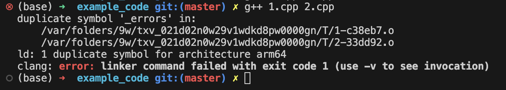

# 第九章 内存模型和名称空间

## 9.1 单独编译

头文件:
- 函数原型/函数声明
- 使用`#define`或`const`定义的符号常量
- 结构(体)声明
- 类声明
- 模板声明
- 内联函数
  - 通常情况下, 除了内联函数之外, 函数定义都不要放在头文件中
  - 内联函数可以放在头文件的原因是: 内联函数本身不会很长, 而且通常不会被多次声明(并且是在调用内联函数的地方, 编译器直接用内联函数的函数体进行了代码替换, 或称为"展开")

源码文件(.cpp):
- 包含与结构有关的函数代码(函数体)
- 包含`函数调用`与`结构(体)`相关的函数代码

## 9.2 存储持续性, 作用域和链接性
C++一共有4种不同的方案存储数据:
- 自动存储持续性
  - `函数定义中声明的变量(包括参数)`的存储持续性为**自动**的. 在**程序开始执行时被创建, 执行完代码块之后就自动释放**.
  - 也称为`局部变量`.

- 静态存储持续性
  - `函数定义之外定义的变量`和`使用关键字static`定义的变量的存储持续性都是**静态**的, 他们在**程序整个运行过程都存在**.
    - 注意是: 整个函数文件(整个源代码)的运行结束之前都不会被自动释放!!
    - `static`关键字一般用在函数内部, 此时函数中定义的变量只会被初始化一次, 哪怕多次调用到包含static语句的函数, 这个变量也不会被再次初始化, 并且单次调用完这个函数之后, 这个变量也不会释放.
    - 也称为`全局变量`.
    - 这个变量的作用域为`此文件的开头到此文件的结尾`, 这个文件内的所有函数都能访问这个变量, 但是`跨文件时该变量仍不可访问`, 如果需要实现`跨文件访问`, 则可以使用`关键字extern对"全局变量"进一步声明`, 此时这个变量具有`外部链接性(external Linkage)`.

- 线程存储持续性(涉及并行编程, 这里不展开)

- 动态存储持续性
  - 这个特指`使用 new 分配的内存空间`, 如果不使用 `delete`去释放, 则这个变量就会出现`内存泄露`问题.
  - 这种内存存储特性有时被称为`自由存储(free store)`或者`堆(heap)`

---

### 9.2.2 作用域
可从下面的代码例子的运行结果中进行观察:
```cpp
/*
    验证变量的作用域.
    包含: 
    1. 自动变量
    2. 不同函数里的自动变量
    3. 函数形参里的变量
*/
#include <iostream>

using namespace std;

void oil(int x);

int main(void)
{
    // 自动变量
    int texas = 31; 
    int year = 2011; 
    cout << "In main(), texas = " << texas << ", ";
    cout << "&texas = " << &texas << endl;
    cout << "In main(), year = " << year << ", ";
    cout << "&year = " << &year << endl;

    cout << "------------------------------" << endl;
    cout << "Let run function oil()..." << endl;
    // 测试一下函数形参里的变量 & 不同函数里定义的"同名"自动变量
    oil(texas);
    /*
        运行代码时可以观察到结论:
        1. 在不同函数里, 哪怕是同名的变量texas, 他们也不是同一个(因为变量在内存中的地址不相同)
        2. 应函数形参, 哪怕是传入的参数, 它在函数里会自动执行一次拷贝, 留意 oil 函数的x, 我们传入的是 texas, 
            但是它的地址已经不是 main 函数中 texas 的地址了, 可以看到在函数中 x 使用的是一个新的内存地址来存放传入参数 texas 的值 31
        3. 从2的结果看, 它也证明了函数形参中书写的变量, 在传入的过程中, 它的影响范围(作用域)也仅限于 "参数列表" 这个括号范围内, 因为在函数体里面使用的是一个全新的变量.
            对于引用变量和指针变量, 我们可以理解为: 编译器也还是重新定义了新的"引用变量/指针变量", 并且做了对应的赋值操作.
        4. 当发生作用域重叠时, 编译器会自动访问 "作用域最近" 的那个变量
        5. 代码块的自动变量在 "代码块运行结束时" 就会被自动释放, 此时编译器索引的 "作用域最近" 的自动变量将不包含代码块里的内容.
    */

    cout << "------------------------------" << endl;
    cout << "After running oil(), we have:" << endl;
    cout << "In main(), texas = " << texas << ", ";
    cout << "&texas = " << &texas << endl;
    cout << "In main(), year = " << year << ", ";
    cout << "&year = " << &year << endl;

    return 0;
}

void oil(int x)
{
    // 不同函数里的"同名"自动变量
    int texas = 5;

    cout << "In oil(), texas = " << texas << ", ";
    cout << "&texas = " << &texas << endl;

    // 测试形参变量
    cout << "In oil(), x = " << x << ", ";
    cout << "&x = " << &x << endl;

    {
        int texas = 113;    // 在代码块中重新定义了一个texas, 由于是不同的作用域, 它不会出发"重定义"错误.
        cout << "In oil()'s block, texas = " << texas << ", ";    // 这个语句会使用"作用域最近"的变量定义, 也就是在这个 block 中的texas
        cout << "&texas = " << &texas << endl;

        // 尝试访问一下同一个函数, 不同代码块中的变量x
        cout << "In oil()'s block, x = " << x << ", ";  // 由于处于同一个函数中, x的作用域是包含这个block的, 所以x仍然有效
        cout << "&x = " << &x << endl;                  // 打印结果是: 这个x与上面打印的x是同一个(内存地址也相同)
    }

    cout << "Post-block, texas = " << texas << ", ";
    cout << "&texas = " << &texas << endl;              // 可以看到, 这个texas并不是代码块里的texas, 而是函数体里定义的 texas, 
                                                        // 说明代码块中的 texas 作用域不会超出 block, 并且 block 里的 texas 其实已经被释放掉了.
}

```
运行结果:


---

### 9.2.4 静态持续性, 外部链接性
代码例子 -- 如何在另一个`.cpp`文件中使用`另一个.cpp`文件的变量和函数
- 本例子一共定义三个子文件: `support.h`, `support.cpp` 和 `external.cpp`
```cpp
/*
  support.h
*/
#ifndef __SUPPORT_H__
#define __SUPPORT_H__

#include <iostream>

// 声明一个外部变量, 这个变量的初始声明位置不是在本文件中, 而是在external.cpp里
// 经过外部声明的变量, 就可以使用其他地方声明的全局变量了(extern关键词表明当前这个变量是从外面来的).
extern double warming;  // 注意, 这里的warming不要进行赋值!

void update(double dt);

void local(void);

#endif
```

```cpp
/*
  support.cpp
*/
#include <iostream>
#include "support.h"

using namespace std;

/// @brief 修改全局变量, dt是增加值
/// @param dt 
void update(double dt)
{
    warming  += dt;
    cout << "Updating Global Warming to " << warming << " degrees." << endl;
}

void local(void)
{
    // 局部变量, 只在local函数内部可见
    double warming = 0.8;
    cout << "Local Warming = " << warming << " degrees." << endl;

    // 使用作用域解析运算符 "::" (两个冒号), 表明这个变量是全局变量
    cout << "But global warming = " << ::warming << " degrees." << endl;
}
```

```cpp
/*
external.cpp
*/
#include <iostream>
#include "support.h"

using namespace std;

double warming = 0.3;       // 全局变量

int main(void)
{
    cout << "Global warming is " << warming << " degrees." << endl;
    update(0.1);
    cout << "Global warming is " << warming << " degrees." << endl;

    local();
    cout << "Global warming is " << warming << " degrees." << endl;

    return 0;
}
```
- 主要的知识点有:
  - 其他文件中如果需要另一个文件里的`全局变量`, 需要使用关键词`extern`进行声明, 如`extern double warming; // 注意不要赋值,如 extern double warming = 0.1;`
  - 在函数中如果需要使用全局变量(避免使用到可能存在的同名局部变量), 可以使用`作用域解析运算符 ::`(双冒号).

---

### 9.2.5 静态变量持续性, 内部链接性 (static)

将`static`用于作用域为**整个文件**的变量时, 该变量的链接性成称为`内部链接性`.
- 简单来说, 就是`用static来修饰一个全局变量`, 此时, 这个全局变量只有`当前文件内部可见`.

代码例子 -- 多个文件一起编译, 但是里面包含同名变量:
  ```cpp
  // file 1 中 定义一个 errors
  int errors = 10;

  int main(void)
  {
      return 0;
  }

  // file 2 中也定义一个 errors
  int errors = 1000;    // 两个文件一起编译时, 编译器将报错"重定义"

  // file 2 中对 errors 增加关键词 static, 此时 errors 只在file 2 中可见, 就没有重定义错误了
  static int errors = 1000; // 此时就没有重定义错误, 但是在file 2中直接使用 errors 的话就不是 file 1 里定义的 errors 变量了
  ```
  


代码例子 -- 体现内部链接性和外部链接性
```cpp
// towfilw1.cpp 代码
#include <iostream>
using namespace std;

void remote_access(void);   // 此函数定义在 twofile2.cpp, 虽然没有使用include, 但是编译的时候是两个文件一起编译, 所以能找到函数定义

int tom = 3;            // 全局变量, 在本文件和其他文件中都可见(其他文件使用此变量需要用extern修饰)
int dick = 30;          // 全局变量, 在本文件和其他文件中都可见(其他文件使用此变量需要用extern修饰)
static int harry = 300;  // 全局变量, 但只在本文件中可见

int main(void)
{
    cout << "main() reports the following address: " << endl;
    cout << "&tom = " << &tom << endl;
    cout << "&dick = " << &dick << endl;
    cout << "&harry = " << &harry << endl;

    cout << "------------\n";

    remote_access();

    return 0;
}


// twofile2.cpp 代码
#include <iostream>
using namespace std;

extern int tom;         // 全局变量, 使用其他文件定义的全局变量(外部变量)
static int dick = 10;   // 全局变量, 但是只在本文件中可见, 不会与其他文件的同名变量冲突
int harry = 200;        // 全局变量, 在本文件中可见, 也可以在其他文件中可见(其他文件使用这里定义的harry要用 extern 修饰) 

void remote_access (void)
{
    cout << "remote_acceess() report the following address: " << endl;
    cout << "&tom = " << &tom << endl;
    cout << "&dick = " << &dick << endl;
    cout << "&harry = " << &harry << endl;

    cout << "---------------" << endl;
}
```

- tom 这个变量在两个文件中是同一个
- dick 在两个文件中是不同的变量, 因为 file2 中使用了static进行了修饰, 此时 file2 的dick只在file2文件内部可见, 而file1中的 dick 在所有文件中都可见(虽然需要借助extern才能实现)
- harry 在两个文件中是不同的变量, 原因同上.

---

### 9.2.6 静态存储的持续性和无链接性(代码块中使用static)
```cpp
/*
    局部静态变量 -- 代码块中使用static
*/

#include <iostream>
using namespace std;

const int ArrSize = 10;

void strCount(const char *str);

int main(void)
{
    char input[ArrSize];
    char next;

    cout << "Enter a line (less than 9 chars):" << endl;

    cin.get(input, ArrSize);    // cin.get(存放输入的变量, 存放的大小)
    while(cin){                 // 用来判断cin是否真的有输入
        // 捕获单个字符, 用来检测是不是因为输入回车才结束输入 (cin.get()遇到回车时, 不仅会结束输入, 还会把回车存放在缓冲区)
        cin.get(next);
        while (next != '\n'){
            cin.get(next);      // 如果不是回车, 则说明用户输入的字符太长了, 用cin.get(next)把缓冲区的东西消耗掉
        }
        strCount(input);        // 统计一共捕获了多少个字符
        cout << "Enter next line (empty line to quit)" << endl;
        cin.get(input, ArrSize);
    }
    cout << "Bye!" << endl;     // 此时输入的是空行.

    return 0;
}

void strCount(const char *str)
{
    static int total = 0;       // 局部静态变量(只会初始化一次, 多次调用strCount也不会反复初始化)
    int count = 0;              // 局部变量(每次都会初始化)

    while(*str++){      // 记得移动指针到下一个元素
        count ++;
    }
    total += count;             // 统计整个程序一共输入了多少个字符

    cout << count << " characters" << endl;
    cout << total << " characters in total." << endl;
    cout << "----------- \n"; 
}
```
- 需要注意的知识点:
  - 代码块中的局部变量如果使用`static修饰`, 此时这个**变量只会被初始化一次**, 而且它不会被在代码块运行结束后就马上释放, 而是类似一个全局变量一样等到程序结束时才释放.

--- 
### 9.2.7 说明符和限定符
通常分为 存储说明符(storage class specifier)或cv-限定符(cv-qualifier).

常见的**存储说明符**有:
- auto (C++11中不再是说明符)
- register
- static
- extern
- thread_local (C++ 11新增的)
- mutable

常见的**cv限定符**有:
- CV 指的是const和volatile这两个限定符的首字母缩写.
- const
  - 一般用来表明这个变量不能再次被修改.
- volatile
  - 用来表明这个变量`即使没有代码去修改它, 这个变量的值也可能发生改变`, 这种情况通常发生在硬件去修改了变量的值(如某个指针指向的内存块存放的是硬件的**串口的时间或信息**, 这时候即使代码逻辑没有对这个内存块进行任何修改, 内存块的值也是可能发生变化的.)
  - 使用volatile的理由:
    - C++中, 编译器会自动进行一种优化: 如果编译器发现代码一直对某个变量进行读取(两次及以上), 并且**变量的值在两次使用之间不发生变化**(比如上面提到的串口指针, 指针一直都指向某个内存块的地址, 是一个数字, 通常在使用这种指针变量时只是反复对指针变量进行读取操作, 而不会去修改这个指针变量), 这时候, 为了提升速度, 编译器会把这个**变量的值**存放到CPU的寄存器中(比如CPU的L1缓冲区), 这就导致代码在真正运行的时候**不会再让程序去查询这个变量在当前时刻具体会不会发生变化**, 而是每次都读出缓冲区里存放的数据(即每次都读出同样的数据), 这显然不是我们想要的, 而使用volatile修饰的话, 编译器就不会对被修饰的变量进行优化, 确保了代码的逻辑正确.
    - 一般不做嵌入式(板卡级别)的开发的话, 通常不使用 volatile.
  - 本书不详细讲volatile.

#### mutable (书本仅进行简单讲解)
- 它的作用是: 用来指出即使**结构(或类)变量为const**, 其**某个成员也可以被修改**.
```cpp
//假设有一个结构体定义
struct data
{
  char name[30];
  mutable int access;   // 使用 mutable
};

int main(void)
{
  const data veep = {"aaa", 0};   // 用const修饰的一个结构体
  strcpy(veep.name, "bbb");       // 这句代码是不允许的, 因为veep被const修饰, name不允许被修改
  veep.access++;                  // 可以执行, 因为mutable修饰了 access, 它可以被修改.
}
```

#### 再谈 const

- 在 C++ 中(注意不是C语言), 被`const修饰的全局变量`**只在当前文件中可见**, 它的存储链接性是**内部**的, **具有类似 static 修饰的效果**.
  - 但是在C语言中, const 修饰的全局变量在其他文件中是可见的.

这个特性的一种使用场景:
- 如果在某个`.h`文件中定义了一个全局变量`const fingers`, 此时, 如果多个`.cpp`文件include 这个头文件, 由于编译器在处理头文件的时候其实是把头文件的内容直接拼接到当前cpp文件前面, 那么此时在**多个文件编译的时候由于局部链接性规则, 是不会弹出重定义错误的**. 但是没有使用const修饰的话, 就会弹出重定义错误.

需要注意, 如果定义**外部常量**, 此时必须在`定义的时候也加上extern关键字`, 并且需要注意, **鉴于单个const在多个文件之间共享, 因此只有一个文件可对其进行初始化**.
```cpp
extern const int state = 10;    // 多个文件之间共享常量时, 需要加上 extern 关键字
// 这个常量只会被初始化一次!!! 也就是说多个文件共享常量时, 这个常量只会被其中一个文件初始化, 具体是谁初始化就要看哪个文件先被执行了!!
```


### 9.2.8 函数和链接性
- C 和 C++ 都**不允许**在一个函数中定义另一个函数!
- 所有的函数的存储持续性都**自动为静态的**, 在整个程序执行期间都存在.
- 默认情况下, 函数的链接性都是外部的, 即可以被另一个文件可以访问到.
  - 加不加 extern 关键词都是一样的.
- 可以在函数前面加 `static`, 限制这个函数只在当前文件中访问, 其他文件里无法访问.
  ```cpp
  static int private(double x);
  
  static int private(double x)
  {
    // 省略若干代码...
  }

  // 此时, private只在当前文件中可以访问, 同时, 其他文件中也允许定义同名的, 同参数列表的 private 函数, 不会触发重定义错误
  ```

  - 在定义了静态函数的文件中调用上面的private函数时, 内部静态函数会覆盖外部的函数


### 9.2.9 语言链接性
- 在C语言中, 编译器一般会对函数进行符号命名, 比如 `spiff(int)` 会转换为 `_spiff`
- 同样的, 在C++中, 编译器也会对重载的函数自动生成额外的符号(名字)进行区分, 如: `spiff(int)` 变成 `_spiff_i`, `spiff(double, double)` 变成`_spiff_d_d`.
  - 那么在C++中调用C语言函数 `spiff(int)` 的时候咋办? 
  - 答案是: **定义函数的时候指明函数的链接性**

```cpp
extern "C" void spiff(int);   // 使用C的规则进行符号查找(此时这个函数的符号生成规则都按照C语言的操作来整)
extern void spiff(int);       // [默认]使用C++规则进行符号查找(符号生成使用 C++ 规则)
extern "C++" void spiff(int);   // [显示地指明]使用C++规则进行符号查找(符号生成使用 C++ 规则)
```


