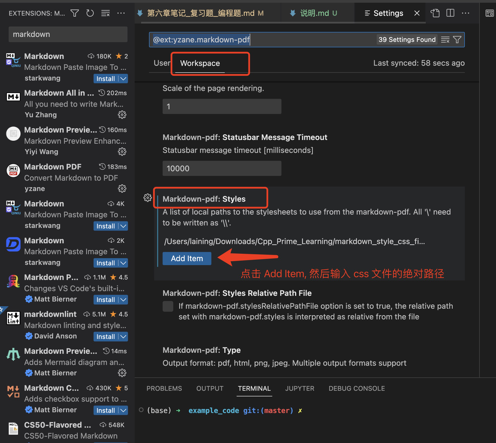

# 文件使用说明:
参考博客: https://www.jianshu.com/p/4856a78b96b6

## css 文件是用来指定 markdown 文件转 PDF 时使用的样式

## 插件设置步骤:
- 安装 `markdonw PDF` 插件
- 安装完成后, 点击旁边的设置按钮, 选择 `Extension Settings` 进入设置页面
  
  - 在设置界面中选择 `workspace` 选项, 然后往下翻, 找到 `style`, 然后 `add item`, 把 `此处 css 文件的绝对路径添加进去`, 如下图所示:
  

## 使用步骤:
- 打开一个要转换的 md 文件, 按 `ctrl + shift + p` 打开命令面板
  - mac 上使用 `cmd + shift + p` 打开

- 命令面板中输入 `markdown pdf` 选择 `markdown pdf: Export (pdf)` 命令即可导出
  - 注意: 第一次使用插件时, 右下角会提示安装 `chromium`, 确认安装后, 重新去命令面板里再来一次 export(pdf) 命令即可
  
