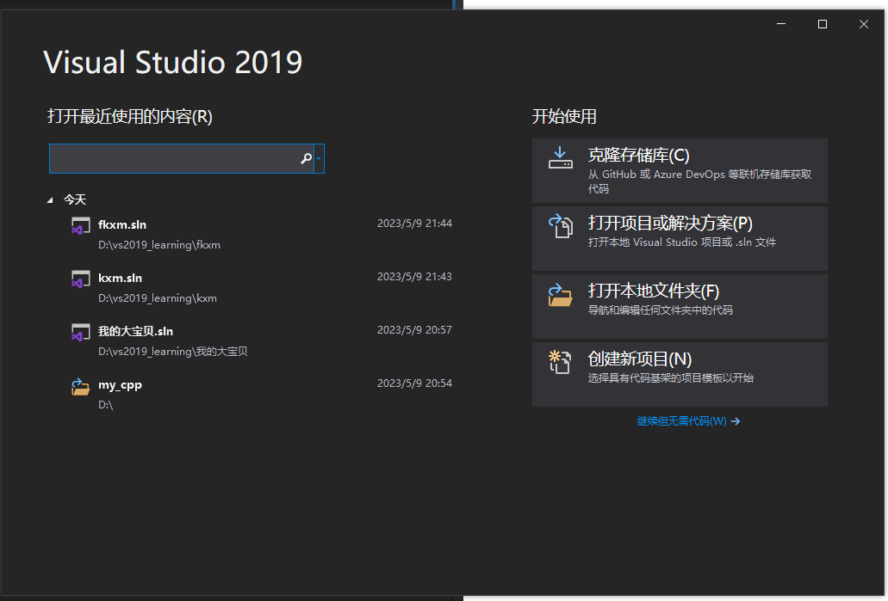
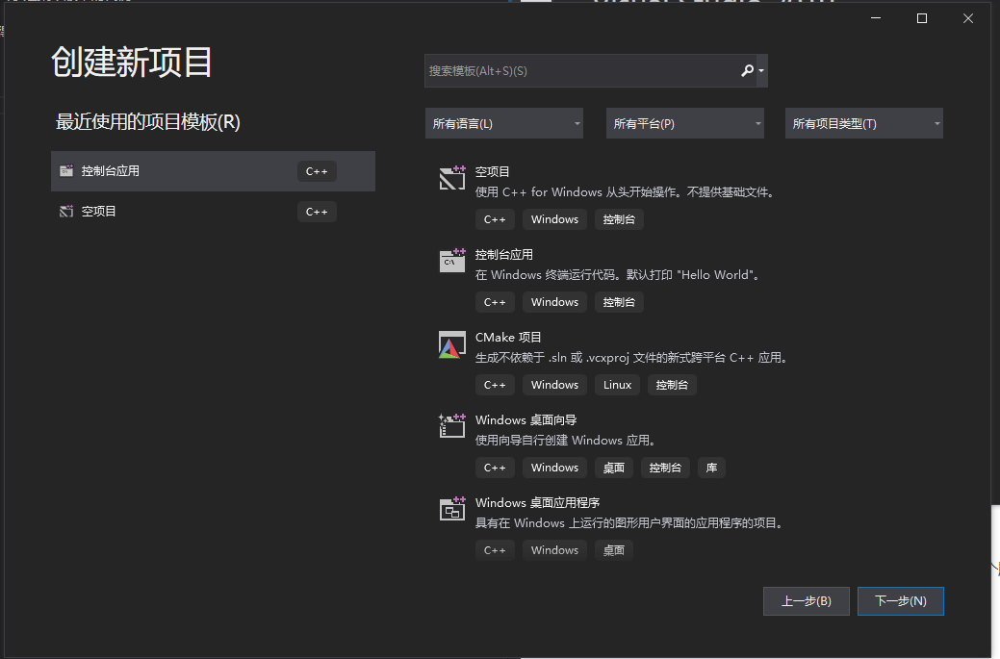
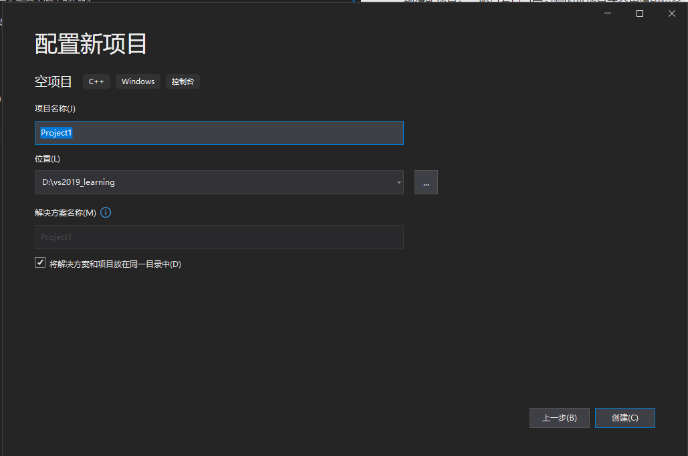
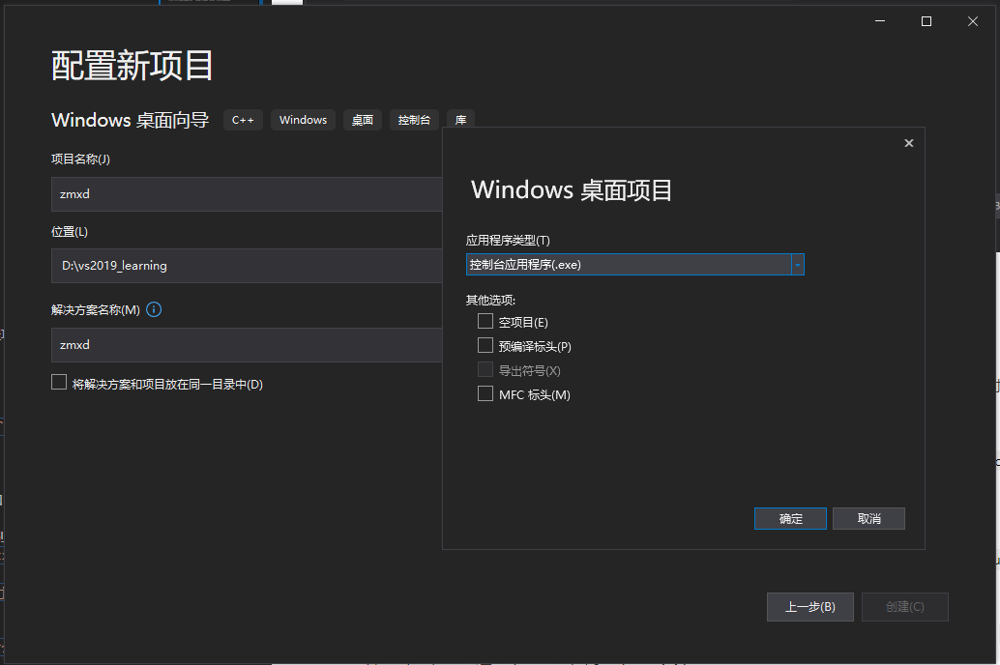
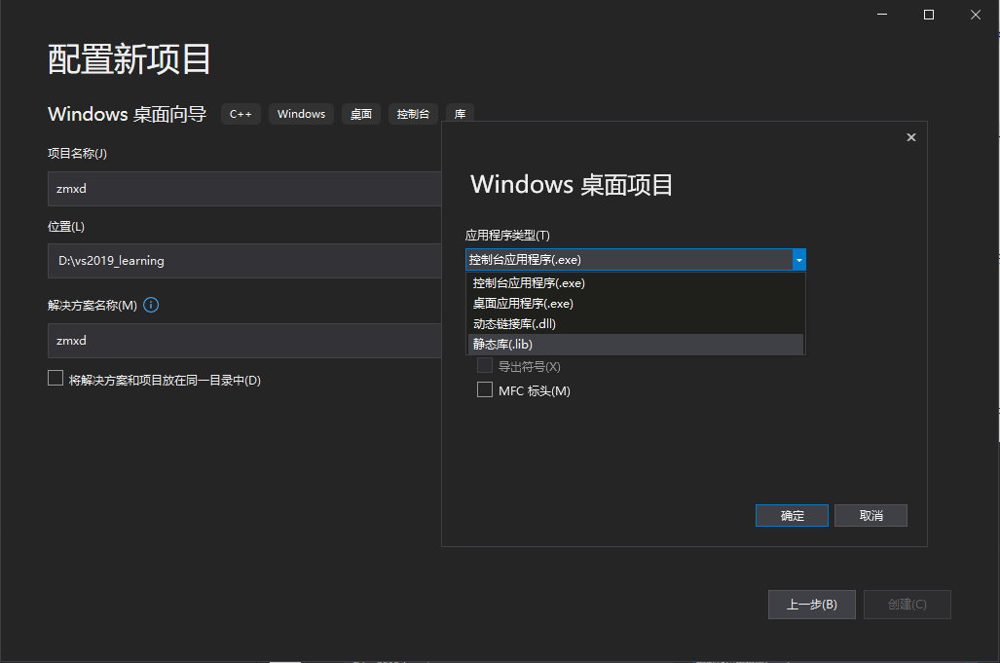
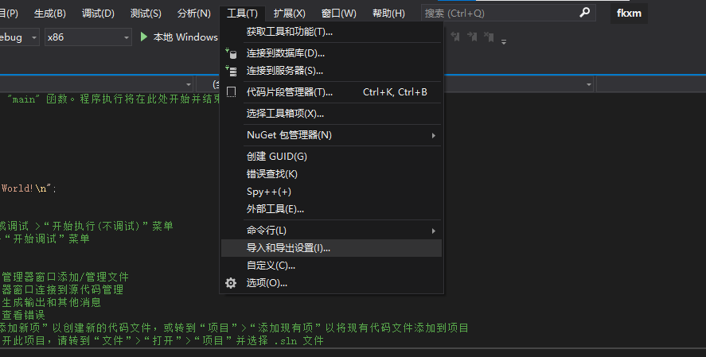
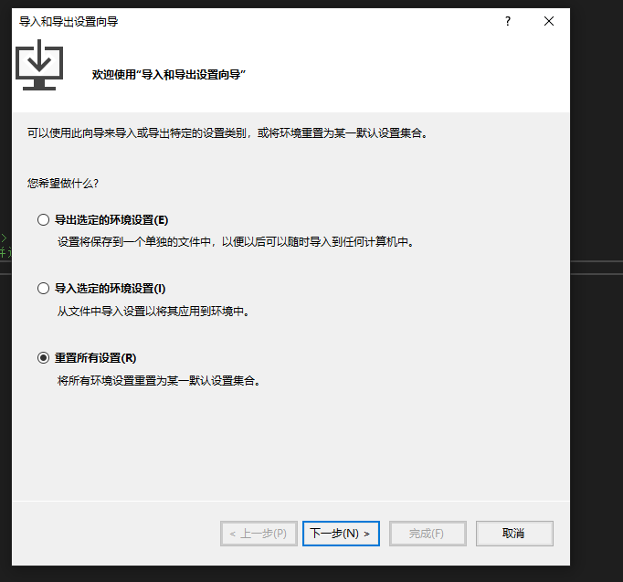
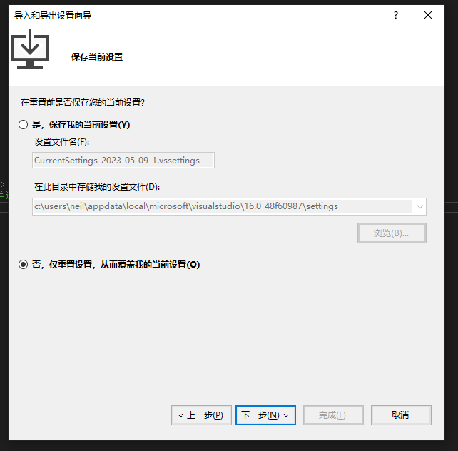
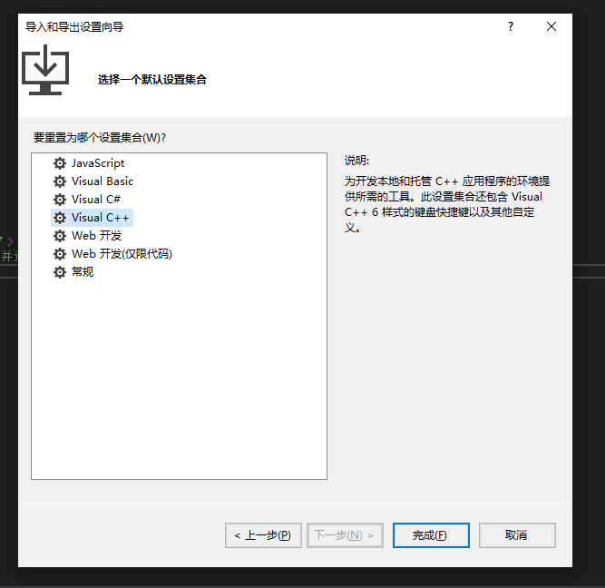
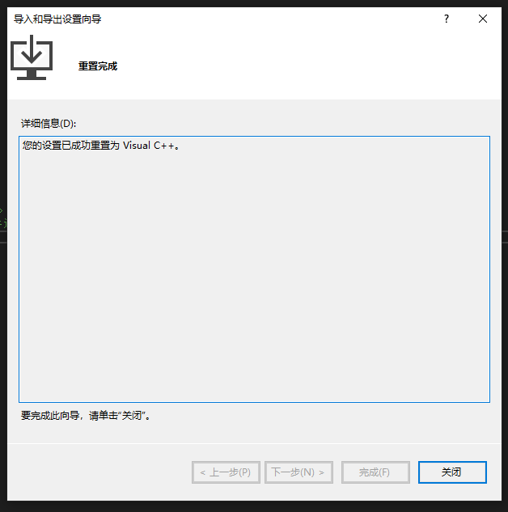

# VS2019 简介
- 参考视频：https://www.bilibili.com/video/BV1pJ411k7WU/?p=2&spm_id_from=333.1007.top_right_bar_window_history.content.click&vd_source=7cf7026bc2c23d0b0b88a3094e5ce55a

## 打开界面

- `克隆存储库`：可以clone github 仓库的代码
- 打开项目或解决方案：打开已有项目，解决方案相当于是某个版本的代码
- 打开本地文件夹
- 创建新项目：一般只有自己学习写的小项目才会用得比较多。

## 创建新项目
### 1. 新建项目

- 空项目：直接创建没有任何代码的项目
- 控制台应用：创建有一些代码示例（hello world）的项目

针对`空项目`和`控制台应用`这两个选项，点开之后都有如下提示：

- 项目名称 和 解决方案名称通常会自动使用相同的名字
- 位置： 可以更改项目存储的路径
- 将解决方案 和 项目 放在同一目录：
  - 解决方案部分:
    - 通常`工程文件`会以`.sln`结尾（全名为`解决方案名.sln`），当我们要打开一个工程项目的时候，可以直接双击这个 sln 文件，就可以通过 visual studio 直接打开这个项目的代码
  
  
  - 项目部分：
    - 默认在创建新项目的时候会自动生成 `项目名.vcxproj`, `项目名.vcxproj.filters`, `项目名.vcxproj.user`这三个文件
      - `.vcxproj`: 项目文件 或 解决方案文件
    - `sln` 和 `.vcxproj` 是项目中最核心的两个文件，不能丢失
      - 通常，要把一个项目发给别人，都是发这两个文件 + 源代码，剩下的 `.filter` 和 `.user` 是没什么用的，删掉也行。
      - 在2013版本中，还会出现 `.sdf` 和 `.suo` 文件，也可以删掉（可以不用发送给别人）
  - 如果勾选了这个选项, 那么 `项目名.sln` 文件就会和 `项目名.vcxproj`, `项目名.vcxproj.filters`, `项目名.vcxproj.user`这三个文件放在同一个文件夹下
  - 如果不勾选, 那么 `项目名.vcxproj`, `项目名.vcxproj.filters`, `项目名.vcxproj.user`这三个文件会放在单独的文件夹里.

注意: 如果安装了多个版本的 visual studio, 通常还是遵循 `用什么版本创建的项目就用什么版本的vs去打开`.

### 2. 新建windows桌面向导 (旧版本中叫 win32 项目)
和上面的空间项目、非空项目一样： windows桌面向导 等同于 空项目， windows桌面应用程序 等同于 非空项目

界面如下：

- 也就是说，这里可以创建 “控制台应用”（和上面的非空项目一样）
- 也可以创建`动态链接库（.dll）`

本质上来说，桌面向导包含了`空项目`、`控制台项目`以及`桌面应用程序`，只是因为太常用了所以单独列出来方便使用罢了。

## 设置环境
在上方状态栏：
- 找到 “工具” -> “导入和导出设置”

这里假定之前莫名其妙有一些设置环境，现在我想重置：

选择好重置之后，就会提示接下来要配置成什么环境(下面选择的是c++)：

- 默认是`常规`， 干啥都可以，现在选c++是专门给c++的环境

完成后如下图：

