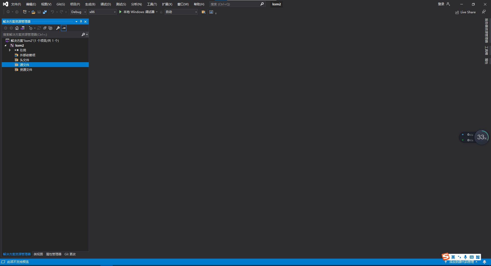
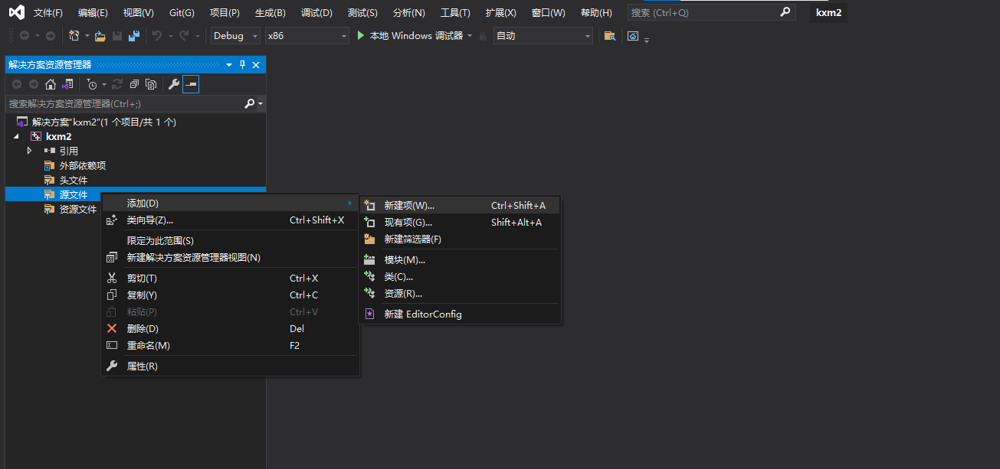
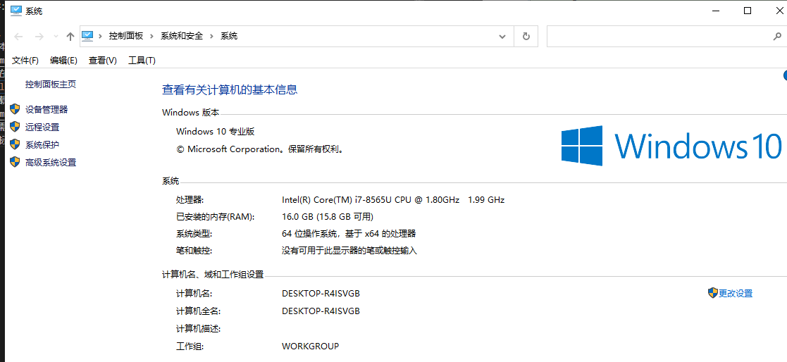

# VS2019 简介
- 参考视频：https://www.bilibili.com/video/BV1pJ411k7WU/?p=2&spm_id_from=333.1007.top_right_bar_window_history.content.click&vd_source=7cf7026bc2c23d0b0b88a3094e5ce55a

## 打开界面

- `克隆存储库`：可以clone github 仓库的代码
- 打开项目或解决方案：打开已有项目，解决方案相当于是某个版本的代码
- 打开本地文件夹
- 创建新项目：一般只有自己学习写的小项目才会用得比较多。

## 创建新项目
### 1. 新建项目

- 空项目：直接创建没有任何代码的项目
- 控制台应用：创建有一些代码示例（hello world）的项目

针对`空项目`和`控制台应用`这两个选项，点开之后都有如下提示：

- 项目名称 和 解决方案名称通常会自动使用相同的名字
- 位置： 可以更改项目存储的路径
- 将解决方案 和 项目 放在同一目录：
  - 解决方案部分:
    - 通常`工程文件`会以`.sln`结尾（全名为`解决方案名.sln`），当我们要打开一个工程项目的时候，可以直接双击这个 sln 文件，就可以通过 visual studio 直接打开这个项目的代码
  
  
  - 项目部分：
    - 默认在创建新项目的时候会自动生成 `项目名.vcxproj`, `项目名.vcxproj.filters`, `项目名.vcxproj.user`这三个文件
      - `.vcxproj`: 项目文件 或 解决方案文件
    - `sln` 和 `.vcxproj` 是项目中最核心的两个文件，不能丢失
      - 通常，要把一个项目发给别人，都是发这两个文件 + 源代码，剩下的 `.filter` 和 `.user` 是没什么用的，删掉也行。
      - 在2013版本中，还会出现 `.sdf` 和 `.suo` 文件，也可以删掉（可以不用发送给别人）
  - 如果勾选了这个选项, 那么 `项目名.sln` 文件就会和 `项目名.vcxproj`, `项目名.vcxproj.filters`, `项目名.vcxproj.user`这三个文件放在同一个文件夹下
  - 如果不勾选, 那么 `项目名.vcxproj`, `项目名.vcxproj.filters`, `项目名.vcxproj.user`这三个文件会放在单独的文件夹里.

注意: 如果安装了多个版本的 visual studio, 通常还是遵循 `用什么版本创建的项目就用什么版本的vs去打开`.

### 2. 新建windows桌面向导 (旧版本中叫 win32 项目)
和上面的空间项目、非空项目一样： windows桌面向导 等同于 空项目， windows桌面应用程序 等同于 非空项目

界面如下：

- 也就是说，这里可以创建 “控制台应用”（和上面的非空项目一样）
- 也可以创建`动态链接库（.dll）`

本质上来说，桌面向导包含了`空项目`、`控制台项目`以及`桌面应用程序`，只是因为太常用了所以单独列出来方便使用罢了。

## 设置（GIU）环境
在上方状态栏：
- 找到 “工具” -> “导入和导出设置”

这里假定之前莫名其妙有一些设置环境，现在我想重置：

选择好重置之后，就会提示接下来要配置成什么环境(下面选择的是c++)：

- 默认是`常规`， 干啥都可以，现在选c++是专门给c++的环境

完成后如下图：

## 基本使用、操作

基于上面的 C++环境设置之后，得到如下显示：

### 添加源文件
- 先找到`解决方案管理器`， 如果没看到，就去`视图`里找一下。
- 从上图中可以看到几个分类，源文件、头文件什么的，这些其实是vs默认的`过滤器`而已，我们也可以自行创建、命名一个新的过滤器
  - 要添加源文件，我们通常还是在`源文件`分类这里，单击鼠标右键，然后按照下图去新建一个文件：
    
  - 选择左侧的`代码`，然后选择对应的文件类别去添加就可以了
    

### 显示行号
- 工具->选项

  - 文本编辑器 -> C/C++  -> 常规 --> 勾选“行号”
  

### 代码编译、运行
- 生成、重新生成解决方案
  - 如果生成过一次的话，再点生成就不会起效果，这时候就要用到重新生成解决方案

- 运行生成好的文件（有以下3中方式）
  - 在 “调试” 里选择运行的方式
    
  - 直接点界面上的 “本地windows调试器” 来运行：
    
  - 按 F5 快捷键

### 添加debug功能按键到工具栏
视图 - 工具栏 - (勾选)调试

# Windows下使用 gcc （Visual Studio 实在太难适应了，最后还是vscode了）
参考博客：https://blog.csdn.net/jiqiren_dasheng/article/details/103775488

1. 首先，去 https://github.com/niXman/mingw-builds-binaries/releases 下载最新的MinGW版本
  
   - 官网：https://www.mingw-w64.org/downloads/#mingw-builds
   - 我在自己的 64位 win10下，下载的是`x86_64-12.2.0-release-win32-seh-msvcrt-rt_v10-rev2.7z`
   - 下载完成后直接解压，长下面的样子
  
1. 然后需要配置一下环境变量，方便直接在 cmd、powershell 里执行`gcc`指令
   - 鼠标右键点击 “此电脑”，选择属性，然后找到左侧的`高级系统设置`（win10如下图）
  
   - 点击`环境变量`
  
   - 选择`系统变量`里的`Path`，双击打开进行编辑
  
   - 在编辑界面`新建`，然后把 MinGW 解压文件夹里的 `bin` 目录的`绝对路径`贴进去，确认就行。
  
1. 重启vscode，然后再打开terminal，直接输入 `gcc`，就能识别到这个命令了（此时得到的报错是没有指定要编译的文件）。
   - 在 windows 中， 比较推荐使用 `g++` 而不是 `gcc`，因为 `g++编译得到的是.exe文件`，可以直接在终端运行，而`gcc得到的是.out文件`，不能直接在终端（powershell中）运行。